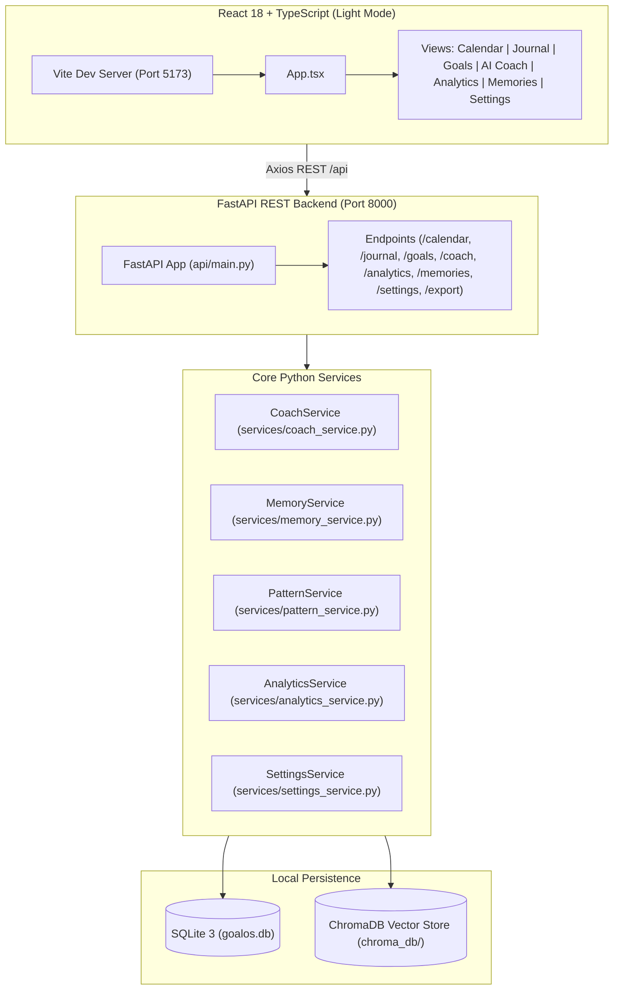

# 🎯 GoalOS

> **A privacy-first, local-first executive life operating system for personal coaching, multi-horizon goal alignment, and cognitive memory retrieval.**

[](https://www.python.org/)
[](https://react.dev/)
[](https://fastapi.tiangolo.com/)
[](https://www.trychroma.com/)
[](https://www.sqlite.org/)
[](https://docs.pydantic.dev/)
[-green.svg)](https://docs.pytest.org/)
[](LICENSE)

---

## 📖 Table of Contents

- [Executive Overview](#-executive-overview)
- [Key Features](#-key-features)
- [System Architecture](#-system-architecture)
- [Frontend Design System](#-frontend-design-system)
- [Hybrid RAG & Cognitive Memory Engine](#-hybrid-rag--cognitive-memory-engine)
- [Agentic AI Coaching & Tool Calling](#-agentic-ai-coaching--tool-calling)
- [Project Directory Structure](#-project-directory-structure)
- [Installation & Quickstart](#-installation--quickstart)
- [Running the Application](#-running-the-application)
- [REST API Reference](#-rest-api-reference)
- [Configuration Reference](#-configuration-reference)
- [Data Portability & Safe Operations](#-data-portability--safe-operations)
- [Testing & Quality Assurance](#-testing--quality-assurance)
- [Privacy & Security Guarantees](#-privacy--security-guarantees)

---

## 🌟 Executive Overview

**GoalOS** bridges the gap between high-level multi-year life visions and daily intentional execution. It provides a structured personal operating system combining:

1. **Deterministic Local Grounding:** All journal logs, active multi-horizon goals, milestones, and daily tasks live locally in SQLite and a local ChromaDB vector store.
2. **Harmonious Light Mode Design System:** A light aesthetic featuring soft celestial mesh gradients, frosted glass capsules, non-redundant metrics, and unified font-size typography scale.
3. **Hybrid RAG Memory:** A 5-factor composite retrieval algorithm (semantic cosine + lexical FTS5 + importance + half-life recency decay + access frequency) ensures relevant insights and lessons resurface at the right moment.
4. **Agentic Function Calling:** When connected to OpenRouter (Claude 3.5 Sonnet, Llama 3.3 70B, Gemini 2.5 Flash, etc.), the AI coach acts as an autonomous agent querying memory vectors and active goals before synthesizing mentor guidance.
5. **Zero-Surprise Privacy & Fallbacks:** No journal data is ever transmitted externally without explicit user opt-in in settings. When offline or without an API key, GoalOS operates seamlessly using deterministic local rule engines.

---

## ⚡ Key Features

### ⏳ 1. 70-Year Life Calendar (Memento Mori)
- **3,640 Discrete Week Grid:** Interactive 52-weeks-per-row grid mapping an entire 70-year lifespan.
- **Visual Milestones:** Real-time calculation of weeks lived, weeks remaining, percentage of life elapsed, and decade markers.
- **Non-Redundant Information:** Single source of truth for metrics with clean visual legend and hover inspector.

### 📓 2. Morning Planning & Evening Reflections
- **Structured Daily Execution:** Daily logging capturing sleep duration/quality, vitality mood, energy levels, gratitude, intentions, and #1 top priority.
- **Goal-Linked Tasks:** Tie daily execution directly to short-, medium-, and long-term milestones.
- **Evening Retrospective:** Consolidate daily wins, extract honest lessons, log deep work blocks, and record free-form reflections.

### 🎯 3. Multi-Horizon Goals Architecture
- **3 Dynamic Horizons:**
  - **1-Month Sprints:** Immediate tactical habit execution.
  - **1-Year Horizons:** Strategic compounding milestones and skill expansion.
  - **5-Year Vision:** Long-term trajectory and identity architecture.
- **Interactive Checklists & Pacing:** Granular milestone progress tracking and auto-calculated completion percentages.

### 🤖 4. AI Coach Studio
- **Autonomous Multi-Pipeline Coaching:**
  - **Morning Planning:** Sets daily priorities and focus.
  - **Evening Review:** Consolidates wins and extracts lessons.
  - **Weekly Sync:** Evaluates longitudinal pacing and weekly review.
  - **Future Self:** Connects current trajectory with 10-year identity.
  - **Goal Alignment:** Stress-tests active goals against daily reality.
- **Grounded Verification:** Transparent evidence reporting with retrieved memory sources and confidence scores.

### 📊 5. Longitudinal Analytics & Pattern Engine
- **Multi-Day Behavioral Detection:** Automatically flags consistency warnings, recovery deficits, or compounding streaks.
- **Deterministic Growth Scores:** Daily scores for Goal Alignment, Consistency, Health, Productivity, and Overall Growth.

### 🧠 6. Cognitive Memory Base (Hybrid RAG)
- **Dual-Write Storage:** Stored in SQLite with local vector embeddings in ChromaDB.
- **Hybrid Search:** Combines keyword search with vector semantic similarity.

### ⚙️ 7. Profile, Privacy & Data Portability
- **AI Privacy Toggle:** Single-switch opt-in for remote LLM coaching.
- **One-Click JSON Export:** Full portable backup of all tables, goals, memories, and logs.
- **Safe Factory Reset:** Automatically creates a timestamped SQLite backup prior to resetting.

---

## 🏗️ System Architecture



---

## 🎨 Frontend Design System

- **Color Palette:** Curated celestial light theme (`bg-[#f8faff]`, soft lavender/indigo gradients, crisp white frosted glass panels).
- **Typography Scale:** Harmonic hierarchy (`h1: text-2xl font-bold`, `h2: text-xl font-bold`, `h3: text-sm font-bold`, `metrics: text-xl font-bold`, `body: text-sm font-normal`, `labels: text-xs font-medium`).
- **Layout Balance:** Symmetrically centered navigation capsules with responsive flex containers.
- **Non-Redundancy:** Strict single-instance metric placement across all views.

---

## 🚀 Installation & Quickstart

### Prerequisites
- **Python 3.11+** installed
- **Node.js 18+** & npm installed

### Setup

1. **Clone the repository:**
   ```bash
   git clone https://github.com/jegadeesh17/GoalOS.git
   cd GoalOS
   ```

2. **Set up Python virtual environment:**
   ```bash
   python -m venv .venv
   # Windows:
   .venv\Scripts\activate
   # Linux/macOS:
   source .venv/bin/activate
   pip install -r requirements.txt
   ```

3. **Install Frontend Dependencies:**
   ```bash
   cd frontend
   npm install
   cd ..
   ```

4. **Configure Environment:**
   ```bash
   cp .env.example .env
   ```
   *(Optional: Add `OPENROUTER_API_KEY` to `.env` for remote LLM coaching)*

---

## 💻 Running the Application

### Option A: One-Click Windows Launcher (Recommended)
Double-click `run_app.bat` or run:
```cmd
run_app.bat
```
This automatically boots:
- **Backend API:** `http://localhost:8000/docs`
- **Frontend App:** `http://localhost:5173`

### Option B: Manual Startup

**Terminal 1 (Backend):**
```bash
python -m uvicorn api.main:app --port 8000 --reload
```

**Terminal 2 (Frontend):**
```bash
cd frontend
npm run dev
```

Open `http://localhost:5173` in your browser.

---

## 📡 REST API Reference

| Endpoint | Method | Description |
|---|---|---|
| `/calendar/summary` | `GET` | Lifespan summary (weeks lived, remaining, percentage) |
| `/calendar/grid` | `GET` | 3,640 week grid rows (52 weeks &times; 70 years) |
| `/journal/today` | `GET` | Current day's journal entry & planned tasks |
| `/journal/date/{target_date}` | `GET` | Specific date journal record |
| `/journal/upsert` | `POST` | Upsert daily log fields |
| `/goals/horizons` | `GET` | Active goals grouped by 1-month, 1-year, 5-year horizons |
| `/goals` | `GET`, `POST` | List and create goals |
| `/goals/{id}` | `GET`, `PUT`, `DELETE` | Goal management |
| `/goals/{id}/milestones` | `POST` | Add milestone to goal |
| `/milestones/{id}` | `PUT`, `PATCH`, `DELETE` | Update or remove milestone |
| `/coach/morning` | `POST` | Generate morning mentor guidance |
| `/coach/evening` | `POST` | Generate evening review analysis |
| `/coach/weekly` | `POST` | Generate weekly review coaching |
| `/coach/future-self` | `POST` | Generate 10-year identity alignment guidance |
| `/coach/goal-alignment` | `POST` | Evaluate specific goal alignment |
| `/analytics/dashboard` | `GET` | Aggregated metrics, scores, and behavioral patterns |
| `/memories` | `GET`, `POST` | List and record cognitive memories |
| `/memories/search` | `GET` | Hybrid lexical & vector semantic search |
| `/settings` | `GET`, `POST` | Profile and AI privacy configuration |
| `/export` | `GET` | Full JSON export of user database |
| `/factory-reset` | `POST` | Auto-backup SQLite and clear data |

---

## 🧪 Testing & Quality Assurance

Run the comprehensive pytest test suite:
```bash
pytest
```
**Results:** **91/91 tests passing (100%)**.

Run frontend typecheck and build validation:
```bash
cd frontend
npm run build
```
**Results:** **0 errors**.

---

## 🔒 Privacy & Security Guarantees

1. **Local-First Storage:** All personal data is saved in local SQLite (`goalos.db`) and local ChromaDB (`chroma_db/`).
2. **Explicit AI Consent:** External LLM calls are disabled by default until explicitly enabled by the user in Settings.
3. **Automated Backups:** Factory reset operations automatically create timestamped SQLite backups (`goalos_backup_YYYYMMDD_HHMMSS.db`).
4. **Input Sanitation & Validation:** All API inputs are validated via strict Pydantic v2 schemas.
