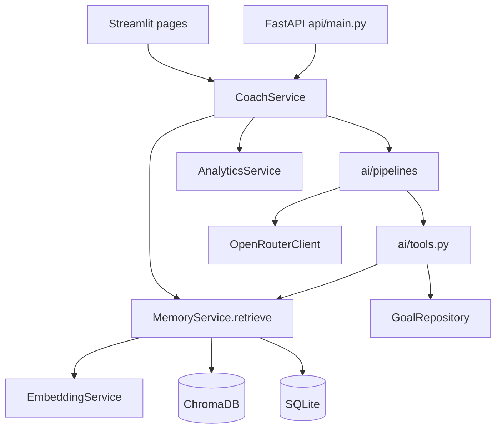

# GoalOS - Agentic Coaching System with RAG Memory

GoalOS is an agentic personal coaching system that combines deterministic analytics, composite memory retrieval (ChromaDB + SQLite), and LLM tool-calling to guide daily execution against long-term goals.

## Quickstart

```bash
pip install -r requirements.txt
pytest -q
python scripts/generate_retrieval_eval.py
uvicorn api.main:app --reload --port 8000
streamlit run app.py
```

See `docs/DEMO.md` for interview walkthrough and `reports/evaluation.md` for retrieval eval.

**Repository:** [github.com/jegadeesh17/GoalOS](https://github.com/jegadeesh17/GoalOS)  
**Live demo:** Deploy via [Streamlit Cloud](https://share.streamlit.io) — see [DEPLOY.md](DEPLOY.md)

## Project Scope
- Single-user, local-first architecture
- Daily logging + weekly reflection workflow
- Retrieval-backed coaching with OpenRouter
- LLM tool-calling agent for morning coaching (fetch goals/memories on demand)
- Transparent fallback behavior when API key/model credits are unavailable

## Technology Stack
| Layer | Technology |
|---|---|
| UI | Streamlit |
| Core language | Python |
| Database | SQLite |
| Memory store | ChromaDB |
| Embeddings | sentence-transformers (`all-MiniLM-L6-v2`) with fallback |
| LLM | OpenRouter (`OPENROUTER_MODEL` configurable) |
| Tests | pytest |

## Architecture & RAG Pipeline



GoalOS follows **Repository → Service → Pipeline → UI/API**:

### RAG flow (5 steps)

1. **Embed** — journal insights stored via `EmbeddingService` (`all-MiniLM-L6-v2`)
2. **Retrieve** — ChromaDB cosine query returns candidate memories
3. **Rank** — composite score re-orders candidates:
   - 40% semantic similarity
   - 30% importance (metadata)
   - 20% recency (30-day half-life decay)
   - 10% frequency (log-scaled access count)
4. **Prompt** — ranked memories injected into session-specific coach prompts
5. **Generate** — OpenRouter returns structured JSON; fallbacks if API fails

### LLM tool calling (function calling)

Morning coaching uses an **agent pipeline** (`agent_morning_coach.py`) where the LLM calls Python tools instead of receiving a pre-built context blob:

| Tool | Purpose |
|------|---------|
| `search_memories(query)` | Semantic retrieval from ChromaDB |
| `get_active_goals()` | Active goals from SQLite |

Flow: LLM requests tools → `ai/tools.py` executes against existing services → results returned → LLM writes the mentor rule. Implemented in `OpenRouterClient.complete_with_tools()` without LangChain.

### MCP (Model Context Protocol)

MCP would expose the same `execute_tool()` functions via a standard protocol for external agents (e.g. Cursor, Claude Desktop). **Not implemented** — in-app tool calling uses the identical functions; MCP would be a thin wrapper if needed later.

## Architecture (modules)
- `database/repositories/*` — persistence and query boundaries
- `services/*` — analytics, memory ranking, orchestration
- `ai/pipelines/*` — task-specific prompting (static + agent)
- `ai/tools.py` — tool schemas and execution
- `ai/openrouter_client.py` — retries, error mapping, JSON parsing, tool loop

### Data Flow
1. User writes logs/goals in Streamlit UI.
2. Logs/goals are stored in SQLite repositories.
3. `MemoryService` embeds and stores/retrieves relevant memory snippets.
4. `CoachService` runs agent morning pipeline with fallback to static coach.
5. Structured output is persisted and shown in UI.

## Retrieval Pipeline Choices
- Embedding model: `all-MiniLM-L6-v2`
- Cache: in-memory embedding cache to avoid repeated encoding
- Offline/test fallback: deterministic hash embedding when transformer load fails

## Prompting Strategy
- Separate coaching prompts by session type (`morning`, `evening`, `weekly`, `reflection`, `goal_alignment`, `future_self`)
- Morning: agent tool-calling with fallback to static context pipeline
- JSON-object completion mode for structured coach outputs

## Failure Modes and Handling
- Missing API key → explicit `no_api_key` response
- Invalid key / credits / missing model → mapped error codes
- On `insufficient_credits`, client automatically retries with a `:free` OpenRouter model
- Retry on 429/5xx with exponential backoff
- JSON parse hardening for fenced/messy LLM output
- Agent failures fall back to static morning coach, then rule-based fallback

## Quickstart (3 Commands)
```powershell
cd c:\Users\jegad\projects\GoalOS
pip install -r requirements.txt
streamlit run app.py
```

## Tests
```powershell
cd c:\Users\jegad\projects\GoalOS
pytest -q
```

## Sample Input / Output
Input (chat):
`I planned deep work but delayed it for meetings. What should I fix tomorrow?`

Typical output:
- one mentor rule
- concrete next-day action
- referenced memories/commitments from prior logs (via tool calling or retrieval)

## Evaluation Artifact (Lightweight, Honest)
Use the included files to run a repeatable quality check:
- `docs/goalos_eval_template.csv`
- `docs/goalos_eval_notes.md`

Recommended first pass:
- 20-30 representative prompts
- Retrieval relevance score (0-2)
- Response usefulness score (1-5)
- Hallucination flag (yes/no)

## Deployment (Streamlit Community Cloud)
See **[DEPLOY.md](DEPLOY.md)** for step-by-step instructions.

Secrets example (`.streamlit/secrets.toml` on Cloud):
```toml
OPENROUTER_API_KEY = "your-key"
OPENROUTER_MODEL = "meta-llama/llama-3.3-70b-instruct:free"
DB_PATH = "goalos.db"
CHROMA_PATH = "chroma_db"
LOG_LEVEL = "INFO"
```

## Limitations
- Personal dataset size can be small early on, reducing retrieval diversity.
- Evaluation is currently lightweight and mostly manual rubric-based.
- Not designed for multi-user access or production-grade auth.

## Interview Prep
See `docs/interview_llm_prep.md` for a 90-second pitch and LLM/RAG/tool-calling talking points.
