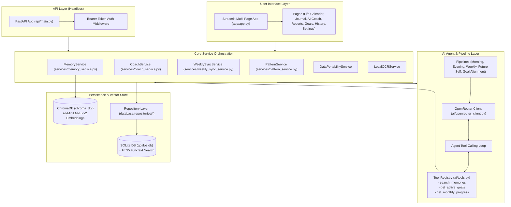

# 🎯 GoalOS

> **A privacy-first, local-first agentic operating system for personal coaching, long-term horizon alignment, and cognitive memory retrieval.**

[](https://www.python.org/)
[](https://streamlit.io/)
[](https://fastapi.tiangolo.com/)
[](https://www.trychroma.com/)
[](https://www.sqlite.org/)
[](https://docs.pydantic.dev/)
[](https://docs.pytest.org/)
[](LICENSE)

---

## 📖 Table of Contents

- [Executive Overview](#-executive-overview)
- [Key Features](#-key-features)
- [System Architecture](#-system-architecture)
- [Hybrid RAG & Cognitive Memory Engine](#-hybrid-rag--cognitive-memory-engine)
- [Agentic AI Coaching & Tool Calling](#-agentic-ai-coaching--tool-calling)
- [Project Directory Structure](#-project-directory-structure)
- [Installation & Quickstart](#-installation--quickstart)
- [Running the Applications](#-running-the-applications)
- [FastAPI Reference](#-fastapi-reference)
- [Configuration Reference](#-configuration-reference)
- [Data Portability & Safe Operations](#-data-portability--safe-operations)
- [Testing & Quality Assurance](#-testing--quality-assurance)
- [Privacy & Security Guarantees](#-privacy--security-guarantees)
- [Related Documentation](#-related-documentation)

---

## 🌟 Executive Overview

**GoalOS** bridges the gap between high-level multi-year life goals and daily intentional execution. It provides a structured personal operating system combining:

1. **Deterministic Local Grounding:** All journal entries, active goals, milestones, and daily tasks live in a local SQLite database and a local ChromaDB vector store.
2. **Hybrid RAG Memory:** A 5-factor composite retrieval algorithm (semantic + lexical + importance + recency + frequency) ensures relevant insights and lessons resurface at the right moment.
3. **Agentic Function Calling:** When connected to OpenRouter (Claude 3.5 Sonnet, Llama 3.3 70B, Gemini 2.5 Flash, etc.), the AI coach acts as an autonomous agent that queries vector memory and active goals on demand before synthesizing mentor guidance.
4. **Zero-Surprise Privacy & Fallbacks:** No journal data is ever transmitted externally without explicit user opt-in in settings. When offline or without an API key, GoalOS operates seamlessly using deterministic local rule engines.

---

## ⚡ Key Features

### ⏳ 1. 70-Year Life Calendar Visualizer
- **Memento Mori Grid:** An interactive 52-weeks-per-row grid mapping an entire 70-year lifespan.
- **Visual Milestones:** Real-time calculation of weeks lived, weeks remaining, percentage of life elapsed, and decade markers.
- **Horizon Alignment:** Direct visual mapping of long-term milestones against life trajectory.

### 📓 2. Multi-Modal Journal & OCR Processing
- **Morning Intentions & Evening Reflections:** Structured daily logging capturing energy, sleep quality, deep work hours, gratitude, top priorities, and anxieties.
- **Handwritten Journal Ingestion:** Scan and extract journal pages from local image folders (`data/Journal/`) using local OCR (pytesseract/Tesseract).
- **Batch CSV Import:** High-throughput batch import pipeline for historical logs with automatic schema reconciliation.
- **Goal-Linked Tasks:** Tie daily execution directly to short-, medium-, and long-term milestones.

### 🧠 3. Cognitive Vector Memory (Hybrid RAG)
- **Dual-Write Architecture:** Every extracted journal insight, milestone, or commitment is recorded in SQLite and indexed in ChromaDB.
- **5-Factor Composite Scoring:** Blends semantic cosine similarity, SQLite FTS5 lexical match, importance weighting, half-life recency decay, and access frequency.
- **MMR Diversity Deduplication:** Prevents redundant or near-identical memories from crowding the context window.
- **Vector Reconciliation:** Built-in repair tools to rebuild stale vector indices and purge deleted references.

### 🤖 4. Agentic AI Coaching with Tool Use
- **Dynamic Context Retrieval:** Rather than dumping the entire database into prompts, the LLM agent autonomously calls `search_memories`, `get_active_goals`, and `get_monthly_progress`.
- **Pattern Recognition over 1-Day Noise:** Evaluates multi-day behavioral patterns and trends rather than reacting to transient single-day fluctuations.
- **Structured Pydantic Validation:** All coaching responses are rigorously parsed and validated into typed schemas (`mentor_rule`, `next_action`, `source`, `pacing_status`).
- **Coaching Pipeline Suite:** Specialized pipelines for Morning Planning, Evening Review, Weekly Sync, Future Self Alignment, and Monthly Progress Coaching.

### 📊 5. Analytics, Reporting & Life Portability
- **Execution Trajectory:** Longitudinal habit consistency, deep work pacing, mood tracking, and goal alignment scores.
- **Single-Click JSON Export:** Export all goals, logs, memories, scores, and coaching outputs into a portable JSON archive.
- **Fail-Safe Database Reset:** Safe factory reset workflow that automatically creates a timestamped SQLite backup prior to clearing local data.

---

## 🏗️ System Architecture



---

## 🔬 Hybrid RAG & Cognitive Memory Engine

GoalOS implements a hybrid retrieval ranking pipeline designed to surface the most relevant past memories and commitments without hallucination:

```
                      ┌────────────────────────────────────────┐
                      │             Query Input                │
                      └──────────────────┬─────────────────────┘
                                         │
                 ┌───────────────────────┴───────────────────────┐
                 ▼                                               ▼
   ┌───────────────────────────┐                   ┌───────────────────────────┐
   │ SQLite FTS5 Lexical Search│                   │ ChromaDB Vector Search    │
   │ (BM25 / Keyword Match)    │                   │ (Cosine Distance via HNSW)│
   └─────────────┬─────────────┘                   └─────────────┬─────────────┘
                 │                                               │
                 └───────────────────────┬───────────────────────┘
                                         ▼
                      ┌────────────────────────────────────────┐
                      │       Composite Scoring Engine         │
                      └──────────────────┬─────────────────────┘
                                         │
                                         ▼
                      ┌────────────────────────────────────────┐
                      │    MMR Diversity Filter (Thresh: 0.94) │
                      └──────────────────┬─────────────────────┘
                                         │
                                         ▼
                      ┌────────────────────────────────────────┐
                      │         Top-K Ranked Memories          │
                      └────────────────────────────────────────┘
```

### Ranking Formula

Each candidate memory is scored according to the 5-factor weighted formula:

$$\text{Score} = 0.35 \cdot S + 0.15 \cdot L + 0.25 \cdot I + 0.15 \cdot R + 0.10 \cdot F$$

Where:
- **$S$ (Semantic Similarity):** Normalized cosine similarity ($1 - \text{distance}$) computed with `sentence-transformers/all-MiniLM-L6-v2`.
- **$L$ (Lexical Match):** Binary indicator ($1.0$ or $0.0$) from SQLite FTS5 full-text indexing.
- **$I$ (Importance):** User-assigned or extracted importance weight $[0.0, 1.0]$.
- **$R$ (Recency Decay):** Exponential half-life decay based on source date:
  $$R = \exp\left(-0.693 \cdot \frac{\Delta\text{days}}{\text{half\_life\_days}}\right) \quad (\text{default half-life} = 30\text{ days})$$
- **$F$ (Access Frequency):** Logarithmic reinforcement score:
  $$F = \min\left(1.0, \frac{\ln(\text{access\_count} + 1)}{\ln(100)}\right)$$

---

## 🤖 Agentic AI Coaching & Tool Calling

GoalOS uses tool calling to ground coaching in real historical data rather than massive monolithic prompts:

1. **Tool Specification:** The LLM is provided structured JSON schemas for available tools:
   - `search_memories(query: str)`: Queries vector and FTS memory stores.
   - `get_active_goals()`: Fetches active goal horizons, deadlines, and priorities.
   - `get_monthly_progress()`: Retrieves month-to-date execution rates and alignment scores.
2. **Tool Execution Loop:** When the model emits tool calls, GoalOS runs the tool functions locally against SQLite and ChromaDB, returning structured JSON results back to the model context.
3. **Synthesis & Schema Enforcement:** The model produces a finalized coaching evaluation validated against Pydantic models.
4. **Deterministic Local Fallback:** If OpenRouter is unconfigured, unreachable, or remote consent is disabled, the system deterministically falls back to heuristic rule generation based on active goals and recent tasks.

---

## 📁 Project Directory Structure

```text
GoalOS/
├── ai/                         # AI orchestration & pipelines
│   ├── pipelines/              # Coaching pipelines (Morning, Evening, Weekly, etc.)
│   │   ├── agent_morning_coach.py  # Tool-calling morning agent loop
│   │   ├── progress_coach.py       # Month-to-date pattern coach
│   │   └── _base.py                # Base pipeline abstractions
│   ├── prompts/                # System & pipeline prompt templates
│   ├── openrouter_client.py    # OpenRouter API client with retries
│   └── tools.py                # LLM function schemas and tool dispatcher
├── api/                        # FastAPI headless service
│   ├── main.py                 # Endpoint definitions & bearer token middleware
│   └── routes/                 # Additional route modules
├── app/                        # Streamlit dashboard
│   ├── pages/                  # Multi-page application modules
│   │   ├── 1_Life_Calendar.py  # 70-year life visualizer (52 weeks/row)
│   │   ├── 2_Journal.py        # Daily log & OCR image upload
│   │   ├── 3_AI_Coach.py       # Pattern coaching & interactive chat
│   │   ├── 4_Report.py         # Analytics, trends & evaluation reports
│   │   ├── 5_Goals.py          # Multi-horizon goal & milestone manager
│   │   ├── 6_History.py        # Journal archive & memory inspector
│   │   └── 7_Settings.py       # Privacy consent, API keys & data controls
│   ├── app.py                  # Streamlit entry point
│   └── bootstrap.py            # Path setup helper
├── components/                 # Reusable Streamlit UI components & design system
│   ├── layout.py               # Hero cards, stat blocks, section dividers
│   ├── theme.py                # Custom CSS styling & color palette
│   └── goal_card.py            # Goal visualization cards
├── config/                     # Configuration management
│   └── settings.py             # Central settings loaded from .env and Streamlit secrets
├── database/                   # SQLite database layer
│   ├── repositories/           # Repository pattern data access classes
│   ├── connection.py           # Thread-safe SQLite connection context managers
│   └── migrations.py           # Additive, versioned database schema migrations
├── docs/                       # Technical specifications & documentation
│   ├── PROJECT_SPEC.md         # Comprehensive engineering specification
│   ├── DEMO.md                 # 5-minute interview & walkthrough guide
│   └── interview_llm_prep.md   # Architectural interview reference
├── models/                     # Pydantic data models & DTOs
│   ├── daily_log.py            # Daily log & task schemas
│   ├── goal.py                 # Goal & horizon schemas
│   ├── memory.py               # Memory & vector embedding schemas
│   └── coach_output.py         # Structured coach response schemas
├── reports/                    # Generated evaluation reports
│   └── evaluation.md           # Retrieval evaluation benchmark report
├── scripts/                    # Utility and benchmark scripts
│   ├── generate_retrieval_eval.py  # Retrieval precision/relevance evaluator
│   └── import_journal_csv.py       # Historical journal CSV batch importer
├── services/                   # Business logic layer
│   ├── coach_service.py        # Central coach orchestration
│   ├── memory_service.py       # Hybrid RAG & memory lifecycle
│   ├── weekly_sync_service.py  # Weekly pacing & alignment calculator
│   ├── pattern_service.py      # Behavioral pattern recognition
│   ├── data_portability_service.py # Export & backup management
│   └── local_ocr_service.py    # Local image OCR extraction
├── tests/                      # Automated test suite (70+ tests)
│   ├── conftest.py             # Test isolation fixtures (temp DB/Chroma)
│   ├── test_memory.py          # Memory retrieval & ranking tests
│   ├── test_tool_calling.py    # LLM tool execution tests
│   ├── test_api.py             # FastAPI endpoint integration tests
│   └── test_repositories.py    # Database CRUD tests
├── Dockerfile                  # Container definition
├── docker-compose.yml          # Container orchestration
├── pyproject.toml              # Project metadata & build tool configuration
└── requirements.txt            # Python package dependencies
```

---

## 🚀 Installation & Quickstart

### Prerequisites
- **Python 3.11+** installed.
- *(Optional)* **Tesseract OCR** for local handwritten image scanning:
  - Windows: [UB-Mannheim/tesseract](https://github.com/UB-Mannheim/tesseract/wiki)
  - macOS: `brew install tesseract`
  - Linux: `sudo apt-get install tesseract-ocr`

### Setup Instructions

#### Windows (PowerShell)
```powershell
# 1. Clone the repository
git clone https://github.com/jegadeesh17/GoalOS.git
cd GoalOS

# 2. Create and activate a virtual environment
py -3.11 -m venv .venv
.\.venv\Scripts\Activate.ps1

# 3. Upgrade pip and install dependencies
python -m pip install --upgrade pip
python -m pip install -r requirements.txt

# 4. Configure environment
Copy-Item .env.example .env

# 5. Run tests to verify installation
python -m pytest -q
```

#### macOS / Linux (Bash)
```bash
# 1. Clone the repository
git clone https://github.com/jegadeesh17/GoalOS.git
cd GoalOS

# 2. Create and activate a virtual environment
python3.11 -m venv .venv
source .venv/bin/activate

# 3. Upgrade pip and install dependencies
pip install --upgrade pip
pip install -r requirements.txt

# 4. Configure environment
cp .env.example .env

# 5. Run tests to verify installation
pytest -q
```

---

## 🖥️ Running the Applications

### 1. Streamlit Interactive Dashboard
Start the full web interface:
```bash
streamlit run app/app.py
```
Open your browser at `http://localhost:8501`.

### 2. FastAPI Headless Coaching Server
Run the REST API locally:
```bash
uvicorn api.main:app --port 8000 --reload
```
Interactive Swagger docs will be available at `http://127.0.0.1:8000/docs`.

### 3. Docker Deployment
Build and start the containerized service:
```bash
docker compose up --build
```

---

## 🌐 FastAPI Reference

The API surface provides programmatic access to morning coaching, health telemetry, and data portability.

| Method | Endpoint | Auth Required | Description |
|---|---|---|---|
| `GET` | `/health` | No | Basic health check |
| `GET` | `/health/details` | Bearer Token | Diagnostic status (log count, memory count, remote consent) |
| `GET` | `/export` | Bearer Token | Full JSON database export |
| `POST` | `/coach/morning` | Bearer Token | Submit morning intentions & receive agentic coaching |

### Example: Morning Coach Request

```bash
curl -X POST http://127.0.0.1:8000/coach/morning \
  -H "Content-Type: application/json" \
  -H "Authorization: Bearer YOUR_API_TOKEN" \
  -d '{
    "target_date": "2026-08-21",
    "gratitude": "Grateful for deep work focus",
    "plans_text": "Finish RAG memory benchmarks and architecture review",
    "tasks": [
      {
        "text": "Run retrieval evaluation script",
        "priority": 1,
        "completed": false
      }
    ],
    "sleep_hours": 7.5,
    "sleep_quality": 4,
    "mood_morning": 4
  }'
```

### Sample Response

```json
{
  "target_date": "2026-08-21",
  "mentor_rule": "Prioritize high-leverage evaluation tasks during peak morning focus before context switching.",
  "next_action": "Execute `python scripts/generate_retrieval_eval.py` and inspect relevance scores.",
  "source": "openrouter:anthropic/claude-sonnet-4",
  "tools_used": ["search_memories", "get_active_goals"],
  "fallback_reason": null
}
```

---

## ⚙️ Configuration Reference

Configuration is managed via `.env` (or Streamlit secrets).

| Variable | Default Value | Description |
|---|---|---|
| `OPENROUTER_API_KEY` | `""` | OpenRouter API Key for live LLM completions. |
| `OPENROUTER_MODEL` | `anthropic/claude-sonnet-4` | Model ID (e.g. `meta-llama/llama-3.3-70b-instruct`, `google/gemini-2.5-flash-preview`). |
| `DB_PATH` | `goalos.db` | Path to the SQLite database file. |
| `CHROMA_PATH` | `chroma_db/` | Path to the persistent ChromaDB directory. |
| `GOALOS_API_TOKEN` | `""` | Bearer token required for API access (mandatory when `ENVIRONMENT=production`). |
| `ENVIRONMENT` | `development` | Deployment environment (`development` or `production`). |
| `LOG_LEVEL` | `INFO` | Application logging level (`DEBUG`, `INFO`, `WARNING`, `ERROR`). |

---

## 💾 Data Portability & Safe Operations

GoalOS ensures you own 100% of your personal data:

- **Complete JSON Export:** Navigate to **Settings $\to$ Export JSON** or call `GET /export` to receive a structured export containing all goals, milestones, daily logs, vector memories, and coach outputs.
- **Fail-Safe Reset with Auto-Backup:** When performing a database reset from Settings, GoalOS automatically generates a timestamped backup copy (`goalos_backup_YYYYMMDD_HHMMSS.db`) before applying clean migrations.
- **Index Rebuild & Repair:** If ChromaDB vector indexes ever fall out of sync with SQLite records, click **Rebuild Vector Index** in Settings to automatically reconcile active documents and prune orphaned vectors.

---

## 🧪 Testing & Quality Assurance

GoalOS maintains an extensive test suite covering repositories, memory retrieval, analytics, API endpoints, and LLM tool calling.

### Running Tests

```bash
# Run pytest suite
pytest -q

# Run with verbose output
pytest -v
```

### Static Analysis

```bash
# Code style and linting
ruff check .

# Static type checking
mypy api ai config database models services
```

### Retrieval Evaluation Benchmark

GoalOS includes a benchmark script to evaluate retrieval relevance:

```bash
python scripts/generate_retrieval_eval.py
```
This regenerates `reports/evaluation.md` with hit/miss relevance metrics across standard query evaluation sets.

---

## 🔒 Privacy & Security Guarantees

1. **Local-First Storage:** SQLite and ChromaDB reside entirely on your local filesystem.
2. **Explicit Remote Consent:** Remote AI coaching is disabled by default. No journal content or memory vectors are sent to OpenRouter until **Allow remote AI coaching** is explicitly enabled in Settings.
3. **Payload Protection:** The FastAPI surface enforces a `64KB` maximum request body limit to prevent memory exhaustion attacks.
4. **Timing-Safe Authentication:** API tokens are validated using constant-time comparison (`hmac.compare_digest`) to prevent timing side-channel attacks.

---

## 📚 Related Documentation

- 📋 [**PROJECT_SPEC.md**](docs/PROJECT_SPEC.md) — Comprehensive technical and functional specification.
- 🎬 [**DEMO.md**](docs/DEMO.md) — 5-minute interactive walkthrough and interview demo script.
- 🚢 [**DEPLOY.md**](DEPLOY.md) — Production hosting and container deployment guidelines.
- 🛡️ [**SECURITY.md**](SECURITY.md) — Security policies and local storage safeguards.
- 🧠 [**interview_llm_prep.md**](docs/interview_llm_prep.md) — Architectural pitch and RAG/Tool-calling technical deep dive.

---

<div align="center">
  <sub>Built with ❤️ for focused execution and long-term vision alignment.</sub>
</div>
