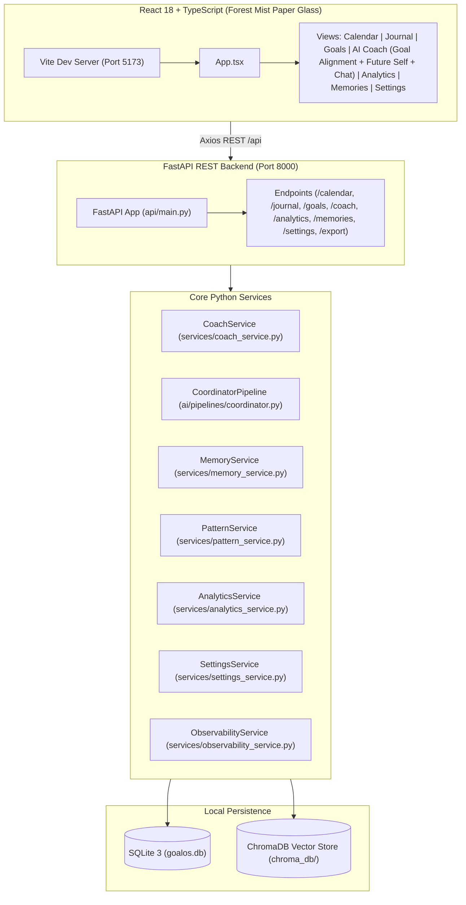

# 🎯 GoalOS

> **A privacy-first, local-first executive life operating system for personal coaching, multi-horizon goal alignment, and cognitive memory retrieval.**

[](https://www.python.org/)
[](https://react.dev/)
[](https://fastapi.tiangolo.com/)
[](https://www.trychroma.com/)
[](https://www.sqlite.org/)
[](https://docs.pydantic.dev/)
[-green.svg)](https://docs.pytest.org/)
[](LICENSE)

---

## 📖 Table of Contents

- [Executive Overview](#-executive-overview)
- [Complete Architecture & Specifications](docs/ARCHITECTURE_AND_SPECIFICATIONS.md)
- [Project Brain & Agent Memory](.agents/brain/README.md)
- [Key Features](#-key-features)
- [System Architecture](#-system-architecture)
- [Frontend Design System](#-frontend-design-system)
- [Agentic AI Coaching & Tool Calling](#-agentic-ai-coaching--tool-calling)
- [Installation & Quickstart](#-installation--quickstart)
- [Running the Application](#-running-the-application)
- [REST API Reference](#-rest-api-reference)
- [Testing & Quality Assurance](#-testing--quality-assurance)
- [Privacy & Security Guarantees](#-privacy--security-guarantees)

---

## 🌟 Executive Overview

**GoalOS** bridges the gap between high-level multi-year life visions and daily intentional execution. It provides a structured personal operating system combining:

1. **Deterministic Local Grounding:** All journal logs, active multi-horizon goals, milestones, and daily tasks live locally in SQLite and a local ChromaDB vector store.
2. **Harmonious Light Mode Design System:** A light aesthetic featuring soft celestial mesh gradients, frosted glass capsules, non-redundant metrics, and unified font-size typography scale.
3. **Hybrid RAG Memory:** A 5-factor composite retrieval algorithm (semantic cosine + lexical FTS5 + importance + half-life recency decay + access frequency) ensures relevant insights and lessons resurface at the right moment.
4. **Agentic Function Calling:** When connected to OpenRouter (Claude 3.5 Sonnet, Llama 3.3 70B, Gemini 2.5 Flash, etc.), the AI coach acts as an autonomous agent querying memory vectors and active goals before synthesizing mentor guidance.
5. **Zero-Surprise Privacy & Fallbacks:** No journal data is ever transmitted externally without explicit user opt-in in settings. When offline or without an API key, GoalOS operates seamlessly using deterministic local rule engines.

---

## ⚡ Key Features

### ⏳ 1. 70-Year Life Calendar (Memento Mori)
- **3,640 Discrete Week Grid:** Interactive 52-weeks-per-row grid mapping an entire 70-year lifespan.
- **Visual Milestones:** Real-time calculation of weeks lived, weeks remaining, percentage of life elapsed, and decade markers.
- **Non-Redundant Information:** Single source of truth for metrics with clean visual legend and hover inspector.

### 📓 2. Notebook Journal Import
- **Six-Section Journal:** Each day follows a fixed structure — Gratitude, Awake (wake–sleep range), Plan (hour-range blocks), Tasks (numbered, ticked when done), Review, and Takeaway.
- **Bulk Import, Not Live Entry:** Handwritten notebook pages are transcribed and bulk-imported (`scripts/import_journal_csv.py` → `JournalImportService`), which normalizes Plan entries into an hourly grid and computes sleep hours only from real Awake times.
- **Day Drawer:** Clicking any day on the calendar opens the full six-section entry for that date.

### 🎯 3. Multi-Horizon Goals Architecture
- **4 Dynamic Horizons** (Goal records are the single source of truth for vision):
  - **1-Month Sprints:** Immediate tactical habit execution.
  - **1-Year Horizons:** Strategic compounding milestones and skill expansion.
  - **5-Year Vision:** Long-term trajectory.
  - **10-Year Identity:** Who the user is becoming.
- **Interactive Checklists & Pacing:** Granular milestone progress tracking and auto-calculated completion percentages.

### 🤖 4. AI Coach Studio
- **Batch-Cadence Coaching Pipelines** (built for weekly/biweekly journal imports, not daily check-ins):
  - **Goal Alignment:** Monthly and yearly pacing of 1-month and 1-year goals against logged days.
  - **Future Self:** Checks whether current execution is on pace for the 5-year and 10-year goals.
- **Coach Chat (Multi-Agent Coordinator):** Free-form conversational coaching backed by `CoordinatorPipeline` — classifies intent, routes to scoped domain toolkits (goals/journal/memory/calendar), persists a session blackboard across turns, and falls back to a deterministic rule engine when remote AI consent is off or no API key is configured.
- **Grounded Verification:** Transparent evidence reporting with retrieved memory sources and confidence scores.

### 📊 5. Longitudinal Analytics & Pattern Engine
- **Multi-Day Behavioral Detection:** Automatically flags consistency warnings, recovery deficits, or compounding streaks.
- **Deterministic Growth Scores:** Daily scores for Goal Alignment, Consistency, Health, Productivity, and Overall Growth.

### 🧠 6. Cognitive Memory Base (Hybrid RAG)
- **Dual-Write Storage:** Stored in SQLite with local vector embeddings in ChromaDB.
- **Hybrid Search:** Combines keyword search with vector semantic similarity.

### ⚙️ 7. Profile, Privacy & Data Portability
- **AI Privacy Toggle:** Single-switch opt-in for remote LLM coaching.
- **One-Click JSON Export:** Full portable backup of all tables, goals, memories, and logs.
- **Safe Factory Reset:** Automatically creates a timestamped SQLite backup prior to resetting.

---

## 🏗️ System Architecture


```mermaid
flowchart TD
    subgraph Frontend_Layer ["React 18 + TypeScript (Forest Mist Paper Glass)"]
        Vite["Vite Dev Server (Port 5173)"]
        App["App.tsx"]
        Views["Views: Calendar | Journal | Goals | AI Coach (Goal Alignment + Future Self + Chat) | Analytics | Memories | Settings"]
        Vite --> App --> Views
    end

    subgraph API_Layer ["FastAPI REST Backend (Port 8000)"]
        FastAPI["FastAPI App (api/main.py)"]
        Routes["Endpoints (/calendar, /journal, /goals, /coach, /analytics, /memories, /settings, /export)"]
        FastAPI --> Routes
    end

    subgraph Service_Layer ["Core Python Services"]
        CoachService["CoachService (services/coach_service.py)"]
        Coordinator["CoordinatorPipeline (ai/pipelines/coordinator.py)"]
        MemoryService["MemoryService (services/memory_service.py)"]
        PatternService["PatternService (services/pattern_service.py)"]
        AnalyticsService["AnalyticsService (services/analytics_service.py)"]
        SettingsService["SettingsService (services/settings_service.py)"]
        Observability["ObservabilityService (services/observability_service.py)"]
    end

    subgraph Data_Layer ["Local Persistence"]
        SQLite[("SQLite 3 (goalos.db)")]
        ChromaDB[("ChromaDB Vector Store (chroma_db/)")]
    end

    Frontend_Layer -->|Axios REST /api| API_Layer
    API_Layer --> Service_Layer
    Service_Layer --> SQLite
    Service_Layer --> ChromaDB
```

---

## 🎨 Frontend Design System

- **Color Palette:** Forest Mist Paper Glass theme — opaque emerald/sage paper surfaces (`glass-panel`: `bg-white/86 backdrop-blur-2xl border border-emerald-100/70 shadow-forest`) over pre-computed static gradient washes (no real-time blur compositing).
- **Typography:** Plus Jakarta Sans for UI text paired with Newsreader serif for editorial/reflective accents (journal quotes, coach directives).
- **Layout Balance:** Symmetrically centered navigation capsules with responsive flex containers.
- **Non-Redundancy:** Strict single-instance metric placement across all views.

---

## 🛠️ Agentic AI Coaching & Tool Calling

`CoordinatorPipeline` exposes 6 tools across 4 isolated domain namespaces, each behind a strict Pydantic/OpenAPI-compatible function schema:

| Domain | Registered Tools |
| :--- | :--- |
| `memory` | `search_memories` |
| `goals` | `get_active_goals`, `get_horizon_pacing` |
| `journal` | `get_recent_logs`, `get_monthly_progress` |
| `calendar` | `get_lifespan_stats` |

**Tool-calling reliability benchmark** (`scripts/benchmark_tool_calling.py`, results in [`reports/TOOL_CALLING_BENCHMARK.md`](reports/TOOL_CALLING_BENCHMARK.md)):
- 7 test scenarios: one execution case per registered tool (6 across the 4 domains), plus 1 negative security case verifying that a call to an unregistered tool (`UNKNOWN_TOOL`) is correctly rejected.
- Each positive case asserts the target tool is registered in its domain (`registry.can_handle`) and executes against representative arguments without a schema or runtime error. The negative case asserts the registry returns an `unknown_tool` error instead of executing.
- **Result:** 7/7 (100%) scenarios passing; average execution latency 4176.5 ms (P95 29218.62 ms, dominated by the memory-search case — all other calls resolve in under 10 ms).
- **Scope:** this benchmark validates tool registration, parameter-schema compliance, execution reliability, and rejection of unauthorized tools. Each test case's target tool is pre-specified and directly invoked rather than chosen by a model, and each case is a single tool call rather than a multi-step task chain — it does not, by itself, measure an LLM's tool-*selection* accuracy from a natural-language query. Live LLM-driven intent classification and routing happens in `CoordinatorPipeline` during real coaching sessions but is a separate concern from what this benchmark scores.

---

## 🚀 Installation & Quickstart

### Prerequisites
- **Python 3.11+** installed
- **Node.js 18+** & npm installed

### Setup

1. **Clone the repository:**
   ```bash
   git clone https://github.com/jegadeesh17/GoalOS.git
   cd GoalOS
   ```

2. **Set up Python virtual environment:**
   ```bash
   python -m venv .venv
   # Windows:
   .venv\Scripts\activate
   # Linux/macOS:
   source .venv/bin/activate
   pip install -r requirements.txt
   ```

3. **Install Frontend Dependencies:**
   ```bash
   cd frontend
   npm install
   cd ..
   ```

4. **Configure Environment:**
   ```bash
   cp .env.example .env
   ```
   *(Optional: Add `OPENROUTER_API_KEY` to `.env` for remote LLM coaching)*

---

## 💻 Running the Application

### Option A: One-Click Windows Launcher (Recommended)
Double-click `run_app.bat` or run:
```cmd
run_app.bat
```
This automatically boots:
- **Backend API:** `http://localhost:8000/docs`
- **Frontend App:** `http://localhost:5173`

### Option B: Manual Startup

**Terminal 1 (Backend):**
```bash
python -m uvicorn api.main:app --port 8000 --reload
```

**Terminal 2 (Frontend):**
```bash
cd frontend
npm run dev
```

Open `http://localhost:5173` in your browser.

---

## 📡 REST API Reference

| Endpoint | Method | Description |
|---|---|---|
| `/calendar/summary` | `GET` | Lifespan summary (weeks lived, remaining, percentage) |
| `/calendar/grid` | `GET` | 3,640 week grid rows (52 weeks &times; 70 years) |
| `/calendar/year` | `GET` | Per-day productivity grid for a calendar year |
| `/journal/today` | `GET` | Current day's journal entry & planned tasks |
| `/journal/date/{target_date}` | `GET` | Specific date journal record |
| `/journal/history` | `GET` | Most recent journal entries (`limit`, default 30) |
| `/journal/upsert` | `POST` | Upsert daily log fields |
| `/goals/horizons` | `GET` | Active goals grouped by 1-month, 1-year, 5-year, 10-year horizons |
| `/goals` | `GET`, `POST` | List and create goals |
| `/goals/{id}` | `GET`, `PUT`, `DELETE` | Goal management |
| `/goals/{id}/milestones` | `POST` | Add milestone to goal |
| `/milestones/{id}` | `PUT`, `PATCH`, `DELETE` | Update or remove milestone |
| `/coach/progress` | `POST` | Goal Alignment: monthly/yearly goal pacing for the month of `date` |
| `/coach/future-self` | `POST` | Future Self: 5-year/10-year goal pacing |
| `/coach/chat` | `POST` | Multi-agent coordinator chat turn (intent routing, scoped tools, session blackboard) |
| `/coach/sessions` | `GET`, `POST` | List or create coach chat sessions |
| `/coach/sessions/{id}` | `GET`, `DELETE` | Fetch or delete a chat session and its messages |
| `/coach/telemetry/summary` | `GET` | Aggregated coordinator latency/tool-use telemetry |
| `/coach/telemetry/traces` | `GET` | Individual coordinator trace spans |
| `/analytics/dashboard` | `GET` | Aggregated metrics, scores, and behavioral patterns |
| `/analytics/scores` | `GET` | Daily score history |
| `/memories` | `GET`, `POST` | List and record cognitive memories |
| `/memories/search` | `GET` | Hybrid lexical & vector semantic search |
| `/settings` | `GET`, `POST` | Profile and AI privacy configuration |
| `/export` | `GET` | Full JSON export of user database |
| `/export/weekly-report` | `GET` | 7-day retrospective digest (Markdown, HTML, or JSON) |
| `/export/reset` | `POST` | Auto-backup, then clear data (requires `{"confirmation": "RESET"}`) |
| `/health`, `/health/details` | `GET` | Liveness and dependency health |

---

## 🧪 Testing & Quality Assurance

Run the comprehensive pytest test suite:
```bash
pytest
```
**Results:** **161/161 tests passing (100%)**.

Run frontend typecheck and build validation:
```bash
cd frontend
npm run build
```
**Results:** **0 errors**.

---

## 🔒 Privacy & Security Guarantees

1. **Local-First Storage:** All personal data is saved in local SQLite (`goalos.db`) and local ChromaDB (`chroma_db/`).
2. **Explicit AI Consent:** External LLM calls are disabled by default until explicitly enabled by the user in Settings.
3. **Automated Backups:** Factory reset operations automatically create timestamped backups (`backups/goalos-backup-YYYYMMDD-HHMMSS.zip`, JSON export + raw `.db`).
4. **Input Sanitation & Validation:** All API inputs are validated via strict Pydantic v2 schemas.
