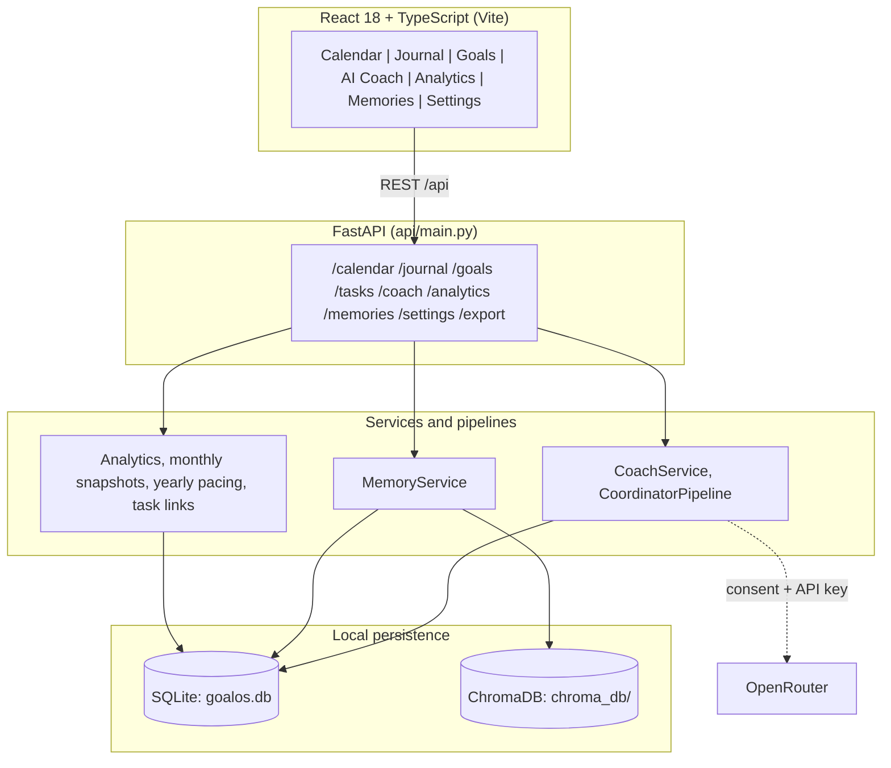

# GoalOS

A privacy-first, local-first life operating system for goal pacing, journal analytics and AI coaching, built on FastAPI, SQLite, ChromaDB and a React frontend.

Live demo (fictional data, no login): https://goalos-api-242711953247.asia-south1.run.app/app

The demo runs the `main` branch, so features that exist only on `dev` (pace points, for example) are not live there yet.

## Features

### 70-year life calendar
- **3,640-week grid:** 52 weeks per row across a 70-year lifespan, with weeks lived, weeks remaining, percentage elapsed and decade markers (`/calendar/summary`, `/calendar/grid`).
- **Year productivity calendar:** a per-day grid for a calendar year; clicking a day opens the full six-section journal entry for that date (`/calendar/year`).

### Notebook journal
- **Six sections:** each day has Gratitude, Awake (wake-to-sleep range), Plan (an hour-by-hour log of what you actually did), Tasks (what you intended to do, numbered and ticked when done), Review and Takeaway.
- **Bulk import:** handwritten pages are transcribed and bulk-imported with `scripts/import_journal_csv.py` (through `JournalImportService`), which normalizes Plan entries into an hourly grid and computes sleep only from real Awake times. The app also has an editor with debounced autosave and an offline queue.

### Multi-horizon goals
- **Four horizons:** 1-month sprints, 1-year, 5-year and 10-year goals. Goal records are the single source of truth for vision.
- **Milestones:** granular checklists with auto-calculated completion percentages.
- **Numeric targets and pacing:** a goal can carry a number to track (metric, unit, optional start, target) and a monthly check-in. Pace is judged against a straight line from start to target by the deadline (ahead, on pace or behind, plus a projection once there are three check-ins). Goals without a number are reported as unmeasured, never given a made-up percentage.
- **Pace points:** for a goal that is back-loaded, you can write your own dated expected values (`/goals/{id}/pace-points`). Expected pace then follows your path, joined point to point, the on-pace band scales to the segment, and the straight-line projection is dropped.

### AI coach
- **Goal Alignment** (`/coach/progress`): monthly and yearly pacing of 1-month and 1-year goals against the logged days. The fallback summary is returned both as one paragraph and as one point per fact (`progress_points`).
- **Future Self** (`/coach/future-self`): checks whether current execution is on pace for the 5-year and 10-year goals, using your real age from the birth date.
- **Coach chat** (`/coach/chat`): a coordinator classifies each message by keyword rules into an intent, reads the matching data itself (active goals, recent logs, memories, life-calendar summary) and puts it in the prompt for one model call. The model does not choose tools. Sessions and a shared blackboard are stored in SQLite.
- **Offline fallback:** with remote AI consent off, no `OPENROUTER_API_KEY`, or a failed call, the same endpoints return local rule-engine output with a `fallback_reason`.
- **Telemetry:** every LLM call records model, tokens, latency and estimated USD cost (`/coach/telemetry/summary`, `/coach/telemetry/traces`, shown in Settings under diagnostics).

### Analytics and patterns
- **Daily scores:** Goal Alignment, Consistency, Health, Productivity, Momentum and an overall growth score. A score with no usable input is left out and the weights are renormalised; it is never counted as zero.
- **Goal alignment from real links:** alignment is the share of completed tasks (14-day window) that serve a goal. You say once which goal a task served (`/tasks/links`), or add cues to a goal so matching tasks link themselves. A task with no known goal is left out, never counted as misaligned. The Goals page lists tasks still to link, and `/goals/attention` shows per goal how many completed tasks it got and how long it has been quiet.
- **Consistency from execution rhythm:** the share of logged days where at least half the tasks were ticked, blended 70/30 with how steady the wake-up time was.
- **Monthly snapshots:** each month's facts (tasks done, solid days, sleep and schedule, score means, stuck tasks, goal state) are stored in `monthly_snapshots`, recomputed from the daily logs after every import or save, and marked provisional until the month is fully imported (`/analytics/monthly`).
- **Levers:** a rank-correlation analysis with a seeded permutation test over the trailing 90 days reports which habits go with more tasks done, with the sample size, a correction for the number of levers tested, and an "association, not proof of cause" caveat.
- **Weekly report:** a 7-day retrospective digest as Markdown, HTML or JSON (`/export/weekly-report`).

### Memory (hybrid retrieval)
- **Dual write:** each memory is stored in SQLite (with an FTS5 index) and embedded into ChromaDB.
- **Five-factor ranking:** semantic 0.35, lexical 0.15, importance 0.25, recency 0.15 (30-day half-life) and frequency 0.10, with near-duplicates (similarity above 0.94) skipped. This ranking is used by `/memories/search`; chat memory context uses SQLite full-text search only.
- **Embeddings:** `all-MiniLM-L6-v2` locally. The demo (`ENVIRONMENT=demo`) uses a hash-based vector instead, as does any install where `sentence-transformers` cannot load.

### Profile, privacy and data portability
- **Consent switch:** remote LLM coaching is off until you turn it on in Settings.
- **JSON export:** a full portable backup of tables, goals, memories and logs (`/export`).
- **Safe factory reset:** writes a timestamped zip backup (`backups/goalos-backup-YYYYMMDD-HHMMSS.zip`, JSON export plus the raw `.db`) before clearing data (`/export/reset`).
- **Local data:** personal data lives in local `goalos.db` and `chroma_db/`. All API inputs that use Pydantic models are validated; a few routes take raw JSON (see Known limitations).

## Quick start

Prerequisites: Python 3.11 and Node 20 (the versions the `Dockerfile` uses), plus npm.

```bash
git clone https://github.com/jegadeesh17/GoalOS.git
cd GoalOS

python -m venv .venv
source .venv/bin/activate            # Windows: .venv\Scripts\activate
pip install -r requirements.txt

cd frontend && npm install && cd ..

cp .env.example .env                 # optional: add OPENROUTER_API_KEY for remote LLM coaching
```

Start the backend and the frontend in two terminals:

```bash
python -m uvicorn api.main:app --port 8000 --reload     # API, docs at http://localhost:8000/docs
cd frontend && npm run dev                              # UI at http://localhost:5173
```

On Windows, `run_app.bat` starts both. To serve the built UI from FastAPI instead, run `npm run build` in `frontend/`; the API then serves it at `/app`.

## Usage

With the API running locally and no API key, one chat turn (the reply is the local rule-engine answer; ids and latency vary):

```bash
curl -X POST http://127.0.0.1:8000/coach/chat \
  -H "Content-Type: application/json" \
  -d '{"message":"What are my active goals and how is my pacing?"}'
```

Output from a local run with an empty database:

```json
{"session_id":"sess_d24fa6abebba","reply":"**[GoalOS Local Executive Rule Engine]**\n• **Intent:** Goals Pacing\n• **Lifespan Awareness:** 1267/3640 weeks lived (34.8%). 2373 weeks remaining.\n• **7-Day Task Completion:** 0.0%\n• **Current Trajectory:** Active Goals (0): None set yet.\n\n**Recommended Executive Action:**\n1. Lock in your core 90-minute deep work block for your #1 priority task before noon.\n2. Protect focus windows from micro-distractions and context switching.\n3. Align today's tasks directly with your active monthly milestone.","agent_name":"DeterministicRuleEngine","intent":"goals_pacing","confidence":0.75,"source":"deterministic_rules","tools_used":[],"citations":[],"blackboard":{"last_fallback_reason":"no_api_key"},"trace_id":"tr_0d5b87fdee86","latency_ms":34.15,"fallback_reason":"no_api_key"}
```

`curl http://127.0.0.1:8000/health` returns `{"status":"ok"}`; `/health/details` adds the row counts. All 53 routes are listed in [docs/ARCHITECTURE_AND_SPECIFICATIONS.md](docs/ARCHITECTURE_AND_SPECIFICATIONS.md) and at `/docs`. Routes are served under `/api` and at the root.

## Running tests

Install the test tools with `pip install -r requirements-dev.txt` (it includes `requirements.txt`; the Docker image installs only `requirements.txt`).

```bash
.venv/Scripts/python -m pytest -q                       # full suite (Linux/macOS: .venv/bin/python)
.venv/Scripts/python -m pytest tests/test_memory.py -q  # one file
```

`pytest --collect-only -q` collects **280** tests. On 2026-10-08 on Windows with Python 3.11.9, a full run gave **280 passed, 0 failed**. CI (`.github/workflows/ci.yml`) also runs `ruff check .`, `mypy api ai config database models services`, `python scripts/generate_retrieval_eval.py` and `docker build .` on Python 3.11. The frontend has no test runner; `cd frontend && npm run build` runs the TypeScript check and the Vite build. Tests use a temporary database (`temp_db` fixture) rather than `goalos.db`.

## Configuration

Copy `.env.example` to `.env`. All variables are read by `configs/settings.py`.

| Variable | Default | Purpose |
|---|---|---|
| `OPENROUTER_API_KEY` | empty | OpenRouter key for remote coaching. Without it the local rule engine answers. |
| `OPENROUTER_MODEL` | `anthropic/claude-sonnet-4` | Model slug. On a timeout, rate limit or model error the client rotates through a built-in list of free models. |
| `DB_PATH` | `<repo>/goalos.db` | SQLite database path. |
| `CHROMA_PATH` | `<repo>/chroma_db` | ChromaDB directory. |
| `GOALOS_API_TOKEN` | empty | Bearer token for protected routes; empty means the API is open. Required when `ENVIRONMENT=production`. |
| `ENVIRONMENT` | `development` | `development`, `demo` (loads the fictional dataset, hash embeddings) or `production` (requires the token). |
| `LOG_LEVEL` | `INFO` | Defined in settings but not read by the current code. |
| `LOG_FILE` | `<repo>/goalos.log` | Defined in settings but not read by the current code. |

Remote AI also needs consent in Settings (stored in the database, off by default).

## Project structure

```
api/          FastAPI app (api/main.py, all routes on one router)
ai/           OpenRouter client, coach pipelines (coordinator, progress, future self), tool registry, prompts
services/     Domain services: coach, memory, analytics, monthly snapshots, pacing, task links, import, reports
database/     SQLite connection, numbered migrations, repositories
models/       Pydantic schemas
configs/      Settings implementation (config/ re-exports it)
frontend/     React 18 + TypeScript + Vite + Tailwind SPA
scripts/      Journal import, demo data builders, retrieval eval, tool-calling benchmark
tests/        pytest suite
data/         Fictional demo database, demo Chroma store, demo seed CSV, retrieval eval fixture (all synthetic)
reports/      Tool-calling benchmark output
docs/         Architecture spec, demo guide, decisions, plans, draw.io diagram
.github/      CI and Cloud Run deploy workflows
.claude/      Claude Code hooks and settings used while developing
.impeccable/   Frontend design-tool configuration
```

## Architecture


```mermaid
flowchart TD
    subgraph Frontend ["React 18 + TypeScript (Vite)"]
        UI["Calendar | Journal | Goals | AI Coach | Analytics | Memories | Settings"]
    end
    subgraph API ["FastAPI (api/main.py)"]
        Routes["/calendar /journal /goals /tasks /coach /analytics /memories /settings /export"]
    end
    subgraph Services ["Services and pipelines"]
        Coach["CoachService, CoordinatorPipeline"]
        Memory["MemoryService"]
        Analytics["Analytics, monthly snapshots, yearly pacing, task links"]
    end
    subgraph Data ["Local persistence"]
        SQLite[("SQLite: goalos.db")]
        Chroma[("ChromaDB: chroma_db/")]
    end
    UI -->|"REST /api"| Routes
    Routes --> Coach
    Routes --> Memory
    Routes --> Analytics
    Coach --> SQLite
    Memory --> SQLite
    Memory --> Chroma
    Analytics --> SQLite
    Coach -.->|"consent + API key"| OpenRouter["OpenRouter"]
```

- **Layering:** `api/main.py` calls `services/`, which call `database/repositories/`, which talk to SQLite and Chroma. Schema changes go through the numbered `MIGRATIONS` list in `database/migrations.py` (10 migrations), applied at startup.
- **Tools:** `ai/tools/` registers 8 tools in 4 namespaces (`memory`: `search_memories`; `goals`: `get_active_goals`, `get_horizon_pacing`, `get_goal_pacing`; `journal`: `get_recent_logs`, `get_monthly_progress`, `get_monthly_snapshots`; `calendar`: `get_lifespan_stats`) with declared parameter schemas. The coach does not call them (it pre-fetches data); they are called directly by the benchmark and tests.
- **Frontend design:** the "Forest Mist Paper Glass" theme, with Plus Jakarta Sans for UI text and Newsreader for the user's own words.
- **Deployment:** the multi-stage `Dockerfile` bundles the built frontend into the API image; see [DEPLOY.md](DEPLOY.md). Details are in [docs/ARCHITECTURE_AND_SPECIFICATIONS.md](docs/ARCHITECTURE_AND_SPECIFICATIONS.md) and [docs/DECISIONS.md](docs/DECISIONS.md).

## Evaluation

- **Tool-calling benchmark** (`scripts/benchmark_tool_calling.py`, results in [`reports/TOOL_CALLING_BENCHMARK.md`](reports/TOOL_CALLING_BENCHMARK.md)): 9 scenarios, one execution case per registered tool (8) plus one negative case that checks a call to an unregistered tool (`UNKNOWN_TOOL`) is rejected. Result: **9/9** passing, average execution latency 2565.25 ms (P95 22471.54 ms, dominated by the memory-search case; `get_monthly_snapshots` took 598.75 ms because that run built the stored snapshots on first read). The benchmark calls each tool directly with representative arguments: the target tool is pre-specified, not chosen by a model, and each case is a single call. It does not measure an LLM's tool-selection accuracy. The report's "Schema validated" wording is not literal; see Known limitations.
- **Retrieval eval** (`python scripts/generate_retrieval_eval.py`): scores three fixed queries from `data/retrieval_eval.json` against three seeded memories by expected-term matches in the top three results, and writes `reports/evaluation.md` (git-ignored). It is a synthetic smoke check, not a benchmark.

## Known limitations

- `POST /export/reset` (the Settings "factory reset" button) returns HTTP 501: `DataPortabilityService` has no reset method yet, and nothing is deleted or backed up.
- Tool arguments are not validated against the declared schemas by the registry. Some handlers check by hand (`get_goal_pacing` rejects an unknown `horizon`; `get_monthly_snapshots` clamps `months`); others convert directly (`int(args.get("days", 7))`). The benchmark report's "Schema validated" label overstates what it checks.
- The coach chat never lets the model choose tools; `OpenRouterClient.complete_with_tools` is used only by tests.
- When no birth date is set, the calendar falls back to `2002-06-17` with target age 70 (`api/main.py:165-168`, `models/user.py:12`, migration default).
- `DELETE /memories/{id}` removes only the SQLite row (`api/main.py:587-593`). The Chroma vector and FTS row stay; retrieval skips ids with no row, and `MemoryService.reconcile_index()`, which removes stale vectors, is not exposed by any route or UI.
- `LOG_LEVEL` and `LOG_FILE` are defined in settings but nothing reads them.
- The public demo runs the `main` branch, so pace points are not live there yet. It has no API token set, so its API is unauthenticated (it holds only fictional data).
- The generated `reports/TOOL_CALLING_BENCHMARK.md` is not hand-edited; its P95 figure is dominated by the first memory-search call (model load).
- The deploy workflow redeploys on any push to `main` or `feat/coach-chat-ui` except pushes that change only `docs/**` or Markdown files, and runs no tests.
- `docs/architecture.drawio` is generated by `scripts/generate_drawio.py`; its page 2 still draws a scoped tool loop that the coordinator does not use.
- Tracked docs under `docs/plans/` are dated implementation plans and are not kept in sync with later changes.

## Documentation

- [docs/README.md](docs/README.md): index of all tracked docs.
- [docs/DECISIONS.md](docs/DECISIONS.md): architecture decision records, each with evidence.
- [CHANGELOG.md](CHANGELOG.md): changes by type, from the commit history.
- [docs/ARCHITECTURE_AND_SPECIFICATIONS.md](docs/ARCHITECTURE_AND_SPECIFICATIONS.md): architecture, schema, the 53-route API table and non-functional notes.
- [DEPLOY.md](DEPLOY.md), [SECURITY.md](SECURITY.md), [docs/DEMO.md](docs/DEMO.md), [CLAUDE.md](CLAUDE.md).

## License

MIT. See [LICENSE](LICENSE).
