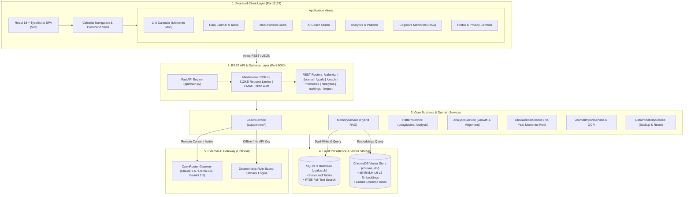
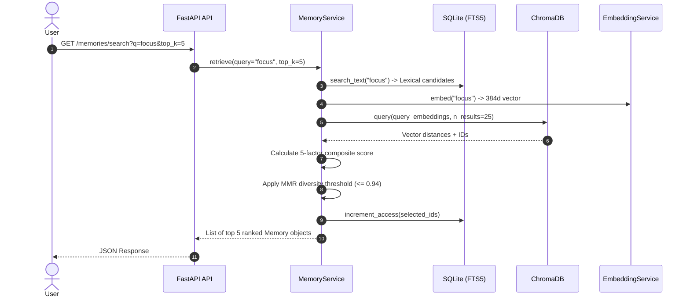
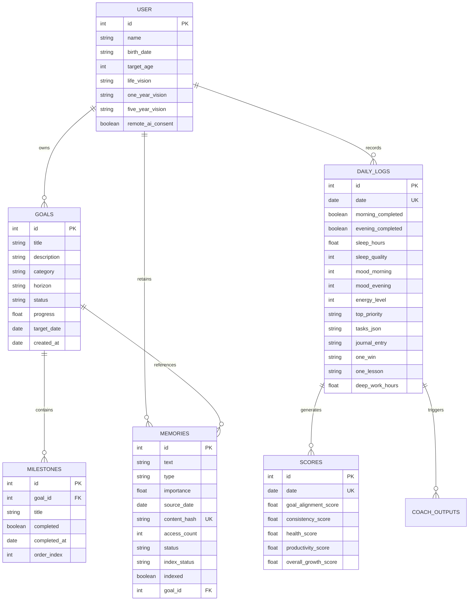

# 🎯 GoalOS — High-Level Architecture & Project Specifications

---

## 📋 Document Control & Metadata

| Field | Value |
| :--- | :--- |
| **Document Title** | GoalOS System Architecture & Technical Specifications |
| **Document Version** | 2.5.0 (Unified Operating System Edition) |
| **System Classification** | Privacy-First Local-First Cognitive Executive OS |
| **Target Platforms** | Desktop Web (React 18 + Vite + TypeScript) / Local REST API (FastAPI) |
| **Repository Root** | `C:\Users\jegad\projects\GoalOS` |
| **Core Persistence** | SQLite 3 (FTS5 enabled) + ChromaDB (Local Cosine Vector Store) |
| **AI Integration** | OpenRouter (Tool-calling Agent Pipelines) + Local Deterministic Fallbacks |

---

## 1. 🌟 System Overview & Core Philosophy

**GoalOS** is an executive life operating system that bridges long-term multi-horizon life visions (70-year calendar, 5-year vision, 1-year horizons, 1-month sprints) with daily tactical execution (morning planning, evening retrospectives, cognitive memory capture, and agentic AI coaching).

```
+-----------------------------------------------------------------------------------+
|                                  GOALOS PHILOSOPHY                                |
+-----------------------------------------------------------------------------------+
|  1. Local-First & Sovereign: User data lives exclusively on the local machine.   |
|  2. Deterministic Foundation: Core scoring and rules run without remote AI.       |
|  3. Cognitive Memory (Hybrid RAG): Dual-indexed FTS5 lexical + vector embeddings. |
|  4. Multi-Horizon Pacing: Aligns daily habits to 70-year lifespan awareness.      |
|  5. Zero-Surprise Privacy: Explicit opt-in switches for any remote LLM coaching. |
+-----------------------------------------------------------------------------------+
```

---

## 2. 🏗️ High-Level System Architecture

GoalOS follows a clean, decoupled 4-tier local architecture:



---

## 3. 🧩 Component Specifications

### 3.1 Frontend Layer (`frontend/src/`)
- **Technology Stack:** React 18, TypeScript 5, Vite, Tailwind CSS 3, Lucide Icons, Axios.
- **Design System:** Celestial Light Mode (`bg-[#f8faff]`, soft lavender/indigo gradients, frosted glass capsules, non-redundant metrics, unified typography scale).
- **Core Views:**
  1. `LifeCalendar.tsx`: 3,640 discrete interactive week blocks (70 years × 52 weeks), decade delimiters, lived/remaining milestone stats.
  2. `JournalView.tsx`: Two-phase morning planning (sleep, mood, intentions, top priority, goal-linked tasks) and evening review (wins, lessons, distractions, deep work hours).
  3. `GoalsView.tsx`: 3-tier horizon view (1-Month Sprints, 1-Year Horizons, 5-Year Visions) with interactive milestones and auto-calculated completion percentages.
  4. `AICoachView.tsx`: Interactive multi-pipeline coaching studio with grounded citations, memory evidence badges, and confidence scoring.
  5. `AnalyticsView.tsx`: Longitudinal charts, habit consistency radar, fatigue indicators, and growth scores.
  6. `MemoriesView.tsx`: Hybrid search explorer, manual memory creator, commitment tracker, and index reconciliation trigger.
  7. `SettingsView.tsx`: Profile customization, remote AI privacy toggle, JSON export, and safe factory reset.

### 3.2 API Layer (`api/main.py`)
- **Technology Stack:** FastAPI, Pydantic v2, Uvicorn, Python 3.11+.
- **Security & Reliability:**
  - `limit_request_body`: Restricts request size to 512KB to prevent memory exhaustion.
  - `require_api_token`: Enforces HMAC Bearer token validation for production environments (`GOALOS_API_TOKEN`).
  - Strict Pydantic input models (`TaskInput`, `MorningCoachRequest`, `EveningCoachRequest`, `GoalCreate`, `MilestoneCreate`, `MemoryStoreRequest`).

### 3.3 Hybrid RAG & Memory Service (`services/memory_service.py`)
GoalOS uses a **5-Factor Composite Retrieval Ranking Algorithm** with dual-write persistence:

$$\text{Composite Score} = 0.35 \cdot S_{\text{sem}} + 0.15 \cdot S_{\text{lex}} + 0.25 \cdot S_{\text{imp}} + 0.15 \cdot S_{\text{rec}} + 0.10 \cdot S_{\text{freq}}$$

Where:
- **$S_{\text{sem}}$ (Semantic Similarity):** Cosine similarity between query embedding and stored document vector:
  $$S_{\text{sem}} = \max(0.0, 1.0 - \text{cosine\_distance})$$
- **$S_{\text{lex}}$ (Lexical Search):** FTS5 full-text matching score ($1.0$ if present in FTS5 candidate set, $0.0$ otherwise).
- **$S_{\text{imp}}$ (Subjective Importance):** Normalized user importance weight $\in [0.0, 1.0]$.
- **$S_{\text{rec}}$ (Exponential Recency Decay):**
  $$S_{\text{rec}} = \exp\left(-\frac{\ln(2) \cdot \Delta t}{T_{\text{half}}}\right) = \exp\left(-\frac{0.693 \cdot \Delta t}{30}\right)$$
- **$S_{\text{freq}}$ (Access Frequency):**
  $$S_{\text{freq}} = \min\left(1.0, \frac{\ln(1 + n)}{\ln(100)}\right)$$
- **MMR Diversity Filtering:** Suppresses candidate memories with pairwise semantic similarity $> 0.94$ against already selected items.



### 3.4 AI Coaching Suite (`services/coach_service.py` & `ai/pipelines/`)
GoalOS provides 6 distinct coaching pipelines:
1. **`agent_morning_coach.py`**: Agentic tool-calling pipeline that queries memories and active goals before synthesizing tactical daily directives.
2. **`evening_coach.py`**: Evaluates completed tasks, win/lesson reflection, deep work blocks, and flags fatigue or recovery deficits.
3. **`weekly_coach.py`**: High-level retrospective summarizing weekly pacing, consistency trends, and sprint adjustments.
4. **`future_self_coach.py`**: Connects immediate actions to 5-year and 10-year identity architecture.
5. **`goal_alignment_coach.py`**: Stress-tests active goals against daily execution logs to surface friction.
6. **`progress_coach.py`**: Longitudinal milestone analysis and pace projections.

#### Tool Calling Specifications (`ai/tools.py`):
When calling remote LLMs (via OpenRouter), the agent is equipped with native function tools:
- `search_memories(query: str, top_k: int = 5)`: Dynamically fetches relevant past insights.
- `get_active_goals(category: Optional[str] = None)`: Fetches active multi-horizon goals and milestones.

---

## 4. 🗄️ Database & Schema Specifications

GoalOS stores all structured entities in SQLite 3 (`goalos.db`) using strict foreign keys and transactional migrations.



---

## 5. 📡 REST API Endpoint Reference

| Method | Endpoint | Description | Auth Required |
| :--- | :--- | :--- | :--- |
| `GET` | `/health` | Basic service health check | No |
| `GET` | `/health/details` | Health check with database & vector counts | Yes (in prod) |
| `GET` | `/calendar/summary` | Memento Mori lifespan summary & week stats | Yes (in prod) |
| `GET` | `/calendar/grid` | 3,640 discrete week grid dataset | Yes (in prod) |
| `GET` | `/journal/today` | Fetch or instantiate today's daily log | Yes (in prod) |
| `GET` | `/journal/date/{target_date}` | Fetch daily log for a specific date | Yes (in prod) |
| `POST` | `/journal/upsert` | Upsert daily log fields & auto-recompute daily scores | Yes (in prod) |
| `GET` | `/journal/history` | Fetch historical daily logs with limit | Yes (in prod) |
| `GET` | `/goals` | List all goals with optional category/status filters | Yes (in prod) |
| `POST` | `/goals` | Create a new multi-horizon goal | Yes (in prod) |
| `PUT` | `/goals/{goal_id}` | Update an existing goal | Yes (in prod) |
| `DELETE` | `/goals/{goal_id}` | Delete a goal and cascade milestones | Yes (in prod) |
| `POST` | `/goals/{goal_id}/milestones` | Add milestone to a goal | Yes (in prod) |
| `PUT` | `/milestones/{milestone_id}` | Update milestone completion status | Yes (in prod) |
| `DELETE` | `/milestones/{milestone_id}` | Delete milestone | Yes (in prod) |
| `POST` | `/coach/morning` | Execute morning coaching pipeline | Yes (in prod) |
| `POST` | `/coach/evening` | Execute evening retrospective pipeline | Yes (in prod) |
| `POST` | `/coach/weekly` | Execute weekly sync coaching pipeline | Yes (in prod) |
| `POST` | `/coach/future-self` | Execute 10-year future self alignment pipeline | Yes (in prod) |
| `POST` | `/coach/goal-alignment` | Stress-test goal feasibility and habit pacing | Yes (in prod) |
| `GET` | `/memories/search` | Execute 5-factor hybrid RAG memory search | Yes (in prod) |
| `POST` | `/memories` | Store new memory (dual-write SQLite + Chroma) | Yes (in prod) |
| `DELETE` | `/memories/{memory_id}` | Delete memory and purge vector index | Yes (in prod) |
| `POST` | `/memories/reconcile` | Repair desynchronized SQLite/Chroma vectors | Yes (in prod) |
| `GET` | `/analytics/trends` | Fetch longitudinal scoring trends | Yes (in prod) |
| `GET` | `/analytics/patterns` | Fetch detected behavioral patterns | Yes (in prod) |
| `GET` | `/settings` | Fetch user profile and consent settings | Yes (in prod) |
| `POST` | `/settings` | Update user profile and consent settings | Yes (in prod) |
| `GET` | `/export/all` | One-click JSON data export | Yes (in prod) |
| `POST` | `/admin/factory-reset` | Safe reset with automated timestamped backup | Yes (in prod) |

---

## 6. 🛡️ System Specifications & Quality Attributes

### 6.1 Functional Requirements Matrix

| Requirement ID | Specification | Verification Method |
| :--- | :--- | :--- |
| **FR-01** | Dual-write persistence: Every memory is stored in SQLite and indexed in ChromaDB. | Unit tests in `test_memory.py` |
| **FR-02** | 5-Factor ranking formula combines semantic, lexical, importance, recency, and frequency. | Algorithmic test suite |
| **FR-03** | Deterministic Fallback: AI pipelines fallback cleanly if OpenRouter is unreachable or consent is disabled. | Mocked network tests |
| **FR-04** | Memento Mori lifespan calculation computes exact week indices without drift. | `test_life_calendar_and_weekly_sync.py` |
| **FR-05** | Daily score calculation computes alignment, consistency, health, and productivity deterministically. | `test_analytics.py` |
| **FR-06** | Safe factory reset generates a backup SQLite file before wiping data. | `test_api.py` |
| **FR-07** | Deduplication: Duplicate journal memories are identified by SHA-256 content hashes. | Repository unit tests |

### 6.2 Non-Functional Specifications

| Dimension | Target Specification | Enforcement Mechanism |
| :--- | :--- | :--- |
| **Data Privacy** | 100% local persistence; zero remote telemetry without consent. | Inverted boolean `remote_ai_consent` gate. |
| **Response Latency** | REST API endpoints return in $< 50\text{ms}$ (excluding remote LLM inference). | Direct SQLite indexing and in-memory Chroma client. |
| **Vector Embedding** | Embedded locally on CPU using `all-MiniLM-L6-v2` with hash fallback. | `EmbeddingService` cache and batching. |
| **Request Security** | Maximum 512KB payload; constant-time HMAC bearer token comparison. | FastAPI middleware & `hmac.compare_digest`. |
| **Data Integrity** | Foreign key cascades, transactional migrations, and index reconciliation. | SQLite WAL mode + `reconcile_index()` RPC. |

---

## 7. 🚀 Operational Deployment & Verification

```bash
# 1. Start FastAPI Backend (Port 8000)
python -m uvicorn api.main:app --port 8000 --reload

# 2. Start React Light Frontend (Port 5173)
cd frontend
npm run dev

# 3. Execute Pytest Test Suite
pytest -q
```
