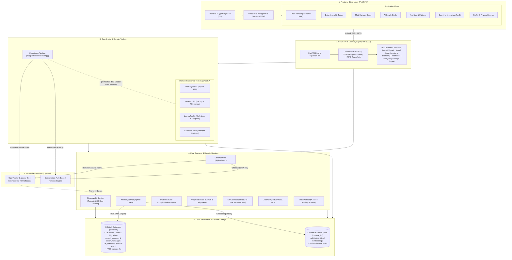
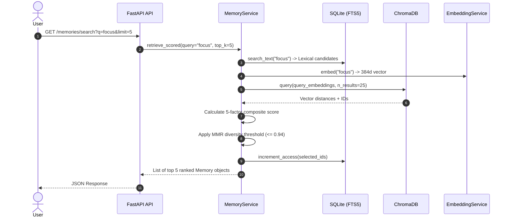
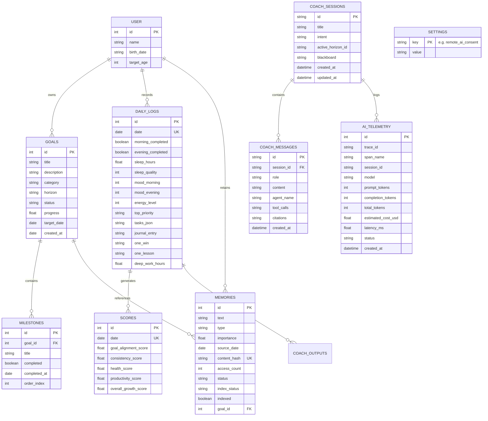

# 🎯 GoalOS — High-Level Architecture & Project Specifications

---

## 📋 Document Control & Metadata

| Field | Value |
| :--- | :--- |
| **Document Title** | GoalOS System Architecture & Technical Specifications |
| **Document Version** | 2.5.0 (Unified Operating System Edition) |
| **System Classification** | Privacy-First Local-First Cognitive Executive OS |
| **Target Platforms** | Desktop Web (React 18 + Vite + TypeScript) / Local REST API (FastAPI) |
| **Repository Root** | `C:\Users\jegad\projects\GoalOS` |
| **Core Persistence** | SQLite 3 (FTS5 enabled) + ChromaDB (Local Cosine Vector Store) |
| **AI Integration** | OpenRouter (prompts grounded with data the server fetches first) + Local Deterministic Fallbacks |

---

## 1. 🌟 System Overview & Core Philosophy

**GoalOS** is an executive life operating system that bridges long-term multi-horizon life visions (70-year calendar, 5-year vision, 1-year horizons, 1-month sprints) with day-to-day execution (journal entries and tasks, cognitive memory capture, and AI coaching).

```
+-----------------------------------------------------------------------------------+
|                                  GOALOS PHILOSOPHY                                |
+-----------------------------------------------------------------------------------+
|  1. Local-First & Sovereign: User data lives exclusively on the local machine.   |
|  2. Deterministic Foundation: Core scoring and rules run without remote AI.       |
|  3. Cognitive Memory (Hybrid RAG): Dual-indexed FTS5 lexical + vector embeddings. |
|  4. Multi-Horizon Pacing: Aligns daily habits to 70-year lifespan awareness.      |
|  5. Zero-Surprise Privacy: Explicit opt-in switches for any remote LLM coaching. |
+-----------------------------------------------------------------------------------+
```

---

## 2. 🏗️ High-Level System Architecture

> [!TIP]
> **Interactive Architecture Diagram:** A complete multi-page editable Draw.io / diagrams.net diagram is available at [`docs/architecture.drawio`](architecture.drawio). It can be opened directly in [app.diagrams.net](https://app.diagrams.net), the VS Code Draw.io extension, or the Draw.io desktop application. It includes:
> 1. **Page 1:** System Topology & Layered Architecture (Presentation, API Gateway, Orchestrator, Services, Dual Storage, External AI Gateway)
> 2. **Page 2:** Cognitive Multi-Agent Supervisor & Scoped Tool Execution Loop (describes a tool loop that the chat coordinator does not use; it pre-fetches data instead)
> 3. **Page 3:** Cognitive Memory Dual-Write & 5-Factor Hybrid RAG Pipeline

GoalOS follows a clean, decoupled 4-tier local architecture:


```mermaid
flowchart TB
    subgraph Client_Layer ["1. Frontend Client Layer (Port 5173)"]
        UI_App["React 18 + TypeScript SPA (Vite)"]
        Nav["Forest Mist Navigation & Command Shell"]
        subgraph Views ["Application Views"]
            V_Cal["Life Calendar (Memento Mori)"]
            V_Jrn["Daily Journal & Tasks"]
            V_Gl["Multi-Horizon Goals"]
            V_Coach["AI Coach Studio"]
            V_Anl["Analytics & Patterns"]
            V_Mem["Cognitive Memories (RAG)"]
            V_Set["Profile & Privacy Controls"]
        end
        UI_App --> Nav --> Views
    end

    subgraph API_Layer ["2. REST API & Gateway Layer (Port 8000)"]
        FastAPI_App["FastAPI Engine (api/main.py)"]
        Middleware["Middleware: CORS | 512KB Request Limiter | HMAC Token Auth"]
        Routers["REST Routers: /calendar | /journal | /goals | /coach (/chat, /sessions, /telemetry) | /memories | /analytics | /settings | /export"]
        FastAPI_App --> Middleware --> Routers
    end

    subgraph Coordinator_Layer ["3. Coordinator & Domain Toolkits"]
        CoordAgent["CoordinatorPipeline (ai/pipelines/coordinator.py)"]
        subgraph Toolkits ["Domain-Partitioned Toolkits (ai/tools/*)"]
            T_Mem["MemoryToolkit (Hybrid RAG)"]
            T_Goal["GoalsToolkit (Pacing & Milestones)"]
            T_Jour["JournalToolkit (Daily Logs & Progress)"]
            T_Cal["CalendarToolkit (Lifespan Statistics)"]
        end
        CoordAgent -. "pre-fetches data (model calls no tools)" .-> Toolkits
    end

    subgraph Service_Layer ["4. Core Business & Domain Services"]
        CoachSvc["CoachService (ai/pipelines/*)"]
        ObsSvc["ObservabilityService (Token & USD Cost Tracking)"]
        MemSvc["MemoryService (Hybrid RAG)"]
        PatternSvc["PatternService (Longitudinal Analysis)"]
        AnalyticsSvc["AnalyticsService (Growth & Alignment)"]
        CalSvc["LifeCalendarService (70-Year Memento Mori)"]
        ImportSvc["JournalImportService & OCR"]
        PortabilitySvc["DataPortabilityService (Backup & Reset)"]
    end

    subgraph Persistence_Layer ["5. Local Persistence & Session Storage"]
        SQLite[("SQLite 3 Database (goalos.db)\n• Structured Tables & Migrations\n• coach_sessions & coach_messages\n• ai_telemetry Spans & Spend\n• FTS5 memory_fts")]
        Chroma[("ChromaDB Vector Store (chroma_db/)\n• all-MiniLM-L6-v2 Embeddings\n• Cosine Distance Index")]
    end

    subgraph External_Gateway ["6. External AI Gateway (Optional)"]
        OpenRouter["OpenRouter Gateway (free-tier model list with fallbacks)"]
        Fallback["Deterministic Rule-Based Fallback Engine"]
    end

    Client_Layer -->|Axios REST / JSON| API_Layer
    API_Layer --> Coordinator_Layer
    API_Layer --> Service_Layer
    Coordinator_Layer --> Service_Layer
    Service_Layer --> Persistence_Layer
    Coordinator_Layer <--> Persistence_Layer
    CoordAgent -->|Remote Consent Active| OpenRouter
    CoordAgent -->|Offline / No API Key| Fallback
    CoachSvc -->|Remote Consent Active| OpenRouter
    CoachSvc -->|Offline / No API Key| Fallback
    OpenRouter -.->|Telemetry Spans| ObsSvc
    ObsSvc --> Persistence_Layer
    MemSvc -->|Dual-Write & Query| SQLite
    MemSvc -->|Embeddings Query| Chroma
```

---

## 3. 🧩 Component Specifications

### 3.1 Frontend Layer (`frontend/src/`)
- **Technology Stack:** React 18, TypeScript 5, Vite, Tailwind CSS 3, Lucide Icons, Axios.
- **Design System:** Forest Mist Paper Glass (opaque emerald/sage glass panels, static pre-computed gradient washes, Plus Jakarta Sans + Newsreader typography, non-redundant metrics).
- **Core Views:**
  1. `YearProductivityCalendar.tsx`: 12-month per-day productivity grid (plus the 70-year week grid); clicking a day opens `DayDetailDrawer.tsx` with that day's full six-section journal.
  2. `JournalView.tsx`: Six-section notebook journal (Gratitude, Awake, Plan, Tasks, Review, Takeaway) with debounced autosave. Plan is an hour-by-hour log of what was done (shown as "Hour by hour"); Tasks is the only forward-looking section. Real data arrives by bulk import (`scripts/import_journal_csv.py` → `JournalImportService`), not live entry.
  3. `GoalsView.tsx`: 4-tier horizon view (1-Month, 1-Year, 5-Year, 10-Year) with interactive milestones and auto-calculated completion percentages. Goal records are the single source of truth for vision. Per goal it also shows numeric-target pacing with monthly check-ins and the user's own expected path (`GoalPace.tsx`), and the completed tasks still to be linked to a goal (`TaskLinker.tsx`).
  4. `AICoachView.tsx`: Goal Alignment (`/coach/progress`, monthly/yearly pacing) and Future Self (`/coach/future-self`, 5/10-year pacing), plus Coordinator chat.
  5. `AnalyticsView.tsx`: Headline averages, the month-by-month review (`MonthlyReview.tsx`), behavioral pattern insights, and the daily growth-score table.
  6. `MemoriesView.tsx`: Hybrid search, manual memory creation, type filters, and a table/card view toggle. No UI or route triggers `MemoryService.reconcile_index()`.
  7. `SettingsView.tsx`: Profile (name, birth date, target age), coach persona (custom prompt, tone), remote AI privacy toggle, JSON export, safe factory reset, and a collapsible AI diagnostics panel (`DiagnosticsPanel.tsx`: tokens, estimated USD spend, latency).

### 3.2 API Layer (`api/main.py`)
- **Technology Stack:** FastAPI, Pydantic v2, Uvicorn, Python 3.11 (CI and the Dockerfile use 3.11).
- **Security & Reliability:**
  - `limit_request_body`: Restricts request size to 512KB to prevent memory exhaustion.
  - `require_api_token`: Compares the `Authorization: Bearer` header with `GOALOS_API_TOKEN` using `hmac.compare_digest`. When the token is empty, every route is open (local mode, and the public demo). `ENVIRONMENT=production` refuses to start without a token (`api/main.py:121-123`).
  - CORS is enabled for all origins (`api/main.py:69-75`).
  - Pydantic input models for most writes (`GoalCreate`, `MilestoneCreate`, `DailyLogUpdate`, `MemoryStoreRequest`, `UserSettingsUpdate`, `CoachChatRequest`, `CoachSessionCreate`, `TaskLinkWrite`, `GoalMeasurementCreate`, `GoalPacePointCreate`). `/journal/upsert`, `/coach/progress`, `/coach/future-self` and `/export/reset` take a raw `dict`; an invalid `date` on the first three raises an unhandled `ValueError` and returns HTTP 500.
  - Every route is registered on one `api_router`, mounted at `/api` (documented in OpenAPI) and again at the root without schema (`api/main.py:788-789`). The built SPA is served at `/app` when `frontend/dist` exists.

### 3.3 Hybrid RAG & Memory Service (`services/memory_service.py`)
GoalOS uses a **5-Factor Composite Retrieval Ranking Algorithm** with dual-write persistence:

$$\text{Composite Score} = 0.35 \cdot S_{\text{sem}} + 0.15 \cdot S_{\text{lex}} + 0.25 \cdot S_{\text{imp}} + 0.15 \cdot S_{\text{rec}} + 0.10 \cdot S_{\text{freq}}$$

Where:
- **$S_{\text{sem}}$ (Semantic Similarity):** Cosine similarity between query embedding and stored document vector:
  $$S_{\text{sem}} = \max(0.0, 1.0 - \text{cosine\_distance})$$
- **$S_{\text{lex}}$ (Lexical Search):** FTS5 full-text matching score ($1.0$ if present in FTS5 candidate set, $0.0$ otherwise).
- **$S_{\text{imp}}$ (Subjective Importance):** Normalized user importance weight $\in [0.0, 1.0]$.
- **$S_{\text{rec}}$ (Exponential Recency Decay):**
  $$S_{\text{rec}} = \exp\left(-\frac{\ln(2) \cdot \Delta t}{T_{\text{half}}}\right) = \exp\left(-\frac{0.693 \cdot \Delta t}{30}\right)$$
- **$S_{\text{freq}}$ (Access Frequency):**
  $$S_{\text{freq}} = \min\left(1.0, \frac{\ln(1 + n)}{\ln(100)}\right)$$
- **MMR Diversity Filtering:** Suppresses candidate memories with pairwise semantic similarity $> 0.94$ against already selected items.
- **Edge cases (`services/memory_service.py`):** a memory with no `source_date` gets a recency score of 0.5; candidates scoring below 0.08 are dropped; the Chroma query asks for `min(top_k * 5, 30)` neighbours; when neither FTS nor Chroma returns candidates, the first active memories are scored by direct text similarity.


```mermaid
sequenceDiagram
    autonumber
    actor User
    participant API as FastAPI API
    participant MS as MemoryService
    participant FTS as SQLite (FTS5)
    participant Chroma as ChromaDB
    participant Embed as EmbeddingService

    User->>API: GET /memories/search?q=focus&limit=5
    API->>MS: retrieve_scored(query="focus", top_k=5)
    MS->>FTS: search_text("focus") -> Lexical candidates
    MS->>Embed: embed("focus") -> 384d vector
    MS->>Chroma: query(query_embeddings, n_results=25)
    Chroma-->>MS: Vector distances + IDs
    MS->>MS: Calculate 5-factor composite score
    MS->>MS: Apply MMR diversity threshold (<= 0.94)
    MS->>FTS: increment_access(selected_ids)
    MS-->>API: List of top 5 ranked Memory objects
    API-->>User: JSON Response
```

### 3.4 AI Coaching Suite (`services/coach_service.py` & `ai/pipelines/`)
GoalOS runs two guided pipelines plus the chat coordinator. Both guided pipelines are built for batch cadence (the user bulk-imports a week or more of notebook pages at a time), so neither assumes daily check-ins:
1. **`progress_coach.py`** (Goal Alignment, `/coach/progress`): Monthly and yearly pacing of 1-month and 1-year goals against the month's logged days, with a historical baseline from the prior month.
2. **`future_self_coach.py`** (Future Self, `/coach/future-self`): Checks whether current execution is on pace for the 5-year and 10-year goals, written from the user's real age (derived from `birth_date`).
3. **`coordinator.py`** (`CoordinatorPipeline`, `/coach/chat`): Free-form chat with keyword intent triage; it pre-fetches domain data and puts it in the prompt, and the model does not choose or call tools.

Morning Planning, Evening Review, Weekly Sync, and the single-goal Goal Alignment picker were removed on 2026-09-27 because they assumed daily interaction.

#### Tool Specifications (`ai/tools/`):
`ai/tools/` registers 8 tools in 4 domain namespaces, each declared with an OpenAI-style function schema (`ToolDefinition.to_openrouter_schema`):

| Domain | Tool | Arguments (declared schema) |
| :--- | :--- | :--- |
| `memory` | `search_memories` | `query` (required string), `top_k` (integer, default 5) |
| `goals` | `get_active_goals` | none |
| `goals` | `get_horizon_pacing` | none |
| `goals` | `get_goal_pacing` | `horizon` (`1-year`, `5-year` or `10-year`; default all three) |
| `journal` | `get_recent_logs` | `days` (integer, default 7) |
| `journal` | `get_monthly_progress` | none |
| `journal` | `get_monthly_snapshots` | `months` (integer, default 6, capped at 12) |
| `calendar` | `get_lifespan_stats` | none |

How they are used today:
- **The chat coordinator does not let the model pick tools.** `CoordinatorPipeline.chat` classifies intent with keyword rules (`classify_intent`, `coordinator.py:41-64`), runs the matching reads itself (`coordinator.py:108-160`: active goals, the last 3 logs, memories, lifespan stats) and pastes the results into the prompt, then makes a single `OpenRouterClient.complete` call with no `tools` argument. The `tools_used` field in the response lists the reads that were run. The lifespan read treats the summary dict as an object (`cal.weeks_lived`, `coordinator.py:157`), raises `AttributeError`, and is skipped by the surrounding `except Exception: pass`; no calendar block reaches the prompt although `get_lifespan_stats` is still listed in `tools_used`.
- Chat memory context comes from SQLite full-text search only (`memory_service.repo.search_text`), not from the 5-factor hybrid retrieval, falling back to the first 4 active memories.
- `OpenRouterClient.complete_with_tools` (a tool-call loop of up to 3 rounds) is exercised only by `tests/test_tool_calling.py`; no production code path calls it.
- The tools are called directly by `scripts/benchmark_tool_calling.py` (9/9 scenarios, see `reports/TOOL_CALLING_BENCHMARK.md`) and by tests.
- The registry does not validate arguments against the declared schemas. Some handlers check by hand (`get_goal_pacing` rejects an unknown `horizon`; `get_monthly_snapshots` clamps `months`); others convert directly (`int(args.get("days", 7))`).
- `ai.tools.TOOL_DEFINITIONS` (the default set) contains the memory, goals and journal tools only (7); `get_lifespan_stats` is available through `get_scoped_tool_definitions(["calendar"])`.

---

## 4. 🗄️ Database & Schema Specifications

GoalOS stores all structured entities in SQLite 3 (`goalos.db`) using strict foreign keys and transactional migrations.


```mermaid
erDiagram
    USER ||--o{ GOALS : owns
    USER ||--o{ DAILY_LOGS : records
    USER ||--o{ MEMORIES : retains
    GOALS ||--o{ MILESTONES : contains
    GOALS ||--o{ MEMORIES : references
    DAILY_LOGS ||--o{ SCORES : generates
    DAILY_LOGS ||--o{ COACH_OUTPUTS : triggers
    COACH_SESSIONS ||--o{ COACH_MESSAGES : contains
    COACH_SESSIONS ||--o{ AI_TELEMETRY : logs

    USER {
        int id PK
        string name
        string birth_date
        int target_age
    }

    SETTINGS {
        string key PK "e.g. remote_ai_consent"
        string value
    }

    GOALS {
        int id PK
        string title
        string description
        string category
        string horizon
        string status
        float progress
        date target_date
        date created_at
    }

    MILESTONES {
        int id PK
        int goal_id FK
        string title
        boolean completed
        date completed_at
        int order_index
    }

    DAILY_LOGS {
        int id PK
        date date UK
        boolean morning_completed
        boolean evening_completed
        float sleep_hours
        int sleep_quality
        int mood_morning
        int mood_evening
        int energy_level
        string top_priority
        string tasks_json
        string journal_entry
        string one_win
        string one_lesson
        float deep_work_hours
    }

    MEMORIES {
        int id PK
        string text
        string type
        float importance
        date source_date
        string content_hash UK
        int access_count
        string status
        string index_status
        boolean indexed
        int goal_id FK
    }

    SCORES {
        int id PK
        date date UK
        float goal_alignment_score
        float consistency_score
        float health_score
        float productivity_score
        float overall_growth_score
    }

    COACH_SESSIONS {
        string id PK
        string title
        string intent
        string active_horizon_id
        string blackboard
        datetime created_at
        datetime updated_at
    }

    COACH_MESSAGES {
        string id PK
        string session_id FK
        string role
        string content
        string agent_name
        string tool_calls
        string citations
        datetime created_at
    }

    AI_TELEMETRY {
        int id PK
        string trace_id
        string span_name
        string session_id
        string model
        int prompt_tokens
        int completion_tokens
        int total_tokens
        float estimated_cost_usd
        float latency_ms
        string status
        datetime created_at
    }
```

The diagram above is a simplified subset. The authoritative schema is the numbered `MIGRATIONS` list in `database/migrations.py` (10 migrations). Tables added by the later migrations and not drawn above:

| Table | Added by | Purpose |
| :--- | :--- | :--- |
| `monthly_snapshots` | migration 8 | One stored analytics snapshot per month (`provisional` or `final`), with metrics and insights JSON |
| `monthly_goal_results` | migration 8 | Each goal's state frozen for a month (no foreign key on purpose, so history survives goal deletion) |
| `goal_measurements` | migration 8 | Monthly check-ins (`goal_id`, `month`, `value`, `note`) against a goal's numeric target |
| `task_links` | migration 9 | Which goal a task serves (`kind` `goal`) or that it serves none (`kind` `none`), keyed by task |
| `goal_pace_points` | migration 10 | The user's own dated expected values for a goal (`goal_id`, `due`, `value`) |

Migration 8 also adds `metric_name`, `metric_unit`, `start_value` and `target_value` to `goals`; migration 9 adds `cues`. Migration 7 dropped the free-text vision columns from `user`, so goals are the only record of the user's vision.

---

## 5. 📡 REST API Endpoint Reference

53 routes, all registered on one `api_router` (`api/main.py`). Each is served under `/api` (the documented path, and the one the SPA uses) and, undocumented, at the root. The table lists the paths without the prefix. `/docs` shows the OpenAPI schema.

**Auth column:** `Token` means the route depends on `require_api_token`: it is enforced only when `GOALOS_API_TOKEN` is set, and otherwise the route is open. The public Cloud Run demo sets no token, so its API is unauthenticated.

| Method | Endpoint | Description | Auth |
| :--- | :--- | :--- | :--- |
| `GET` | `/health` | Liveness check; returns `{"status": "ok"}` | No |
| `GET` | `/health/details` | Status plus `openrouter_configured`, `remote_ai_consent`, `log_count`, `memory_count`, `goal_count` | Token |
| `GET` | `/calendar/summary` | Memento Mori lifespan summary (weeks lived, remaining, percentage); optional `reference_date` | Token |
| `GET` | `/calendar/grid` | 3,640-cell week grid (52 weeks x 70 years); optional `reference_date` | Token |
| `GET` | `/calendar/year` | Per-day productivity grid for a calendar year (`year`, `reference_date`) | Token |
| `GET` | `/journal/today` | Today's daily log, or an empty log (id 0) if none exists | Token |
| `GET` | `/journal/date/{target_date}` | Daily log for one date, or an empty log (id 0) | Token |
| `POST` | `/journal/upsert` | Upsert daily-log fields (raw JSON body, `date` defaults to today), re-score from that day on, refresh that month's snapshot | Token |
| `GET` | `/journal/history` | Most recent daily logs (`limit` 1-365, default 30) | Token |
| `GET` | `/goals` | List goals with milestones; filters `status`, `category`, `horizon` | Token |
| `GET` | `/goals/horizons` | Active goals grouped by 1-month, 1-year, 5-year and 10-year horizon | Token |
| `GET` | `/goals/pacing` | Measured pace of 1-year, 5-year and 10-year goals against numeric targets (`horizon` filter) | Token |
| `GET` | `/goals/attention` | Completed tasks per active goal over the last `days` (1-90, default 14) and days quiet | Token |
| `GET` | `/goals/{goal_id}` | One goal | Token |
| `POST` | `/goals` | Create a goal (optional numeric target: `metric_name`, `metric_unit`, `start_value`, `target_value`; optional `cues`) | Token |
| `PUT` | `/goals/{goal_id}` | Update a goal | Token |
| `DELETE` | `/goals/{goal_id}` | Delete a goal (milestones, check-ins, pace points and links cascade) | Token |
| `GET` | `/goals/{goal_id}/measurements` | List the goal's monthly check-ins | Token |
| `PUT` | `/goals/{goal_id}/measurements` | Save a monthly check-in (`month` YYYY-MM, `value`, optional `note`) | Token |
| `DELETE` | `/goals/{goal_id}/measurements/{month}` | Remove a check-in | Token |
| `GET` | `/goals/{goal_id}/pace-points` | List the user-written expected-path points | Token |
| `PUT` | `/goals/{goal_id}/pace-points` | Save a pace point (`due` date, `value`) | Token |
| `DELETE` | `/goals/{goal_id}/pace-points/{due}` | Remove a pace point | Token |
| `POST` | `/goals/{goal_id}/milestones` | Add a milestone to a goal | Token |
| `PUT` | `/milestones/{milestone_id}` | Update a milestone | Token |
| `PATCH` | `/milestones/{milestone_id}` | Update a milestone (same handler as PUT) | Token |
| `DELETE` | `/milestones/{milestone_id}` | Delete a milestone | Token |
| `GET` | `/tasks/review` | Completed tasks whose goal is still unknown, most repeated first (`limit` 1-500, default 50) | Token |
| `PUT` | `/tasks/links` | Link a task to a goal, or mark it as serving none (`key`, `kind`, `goal_id`); re-scores every day | Token |
| `DELETE` | `/tasks/links/{key}` | Remove a saved task link; re-scores every day | Token |
| `POST` | `/coach/progress` | Goal Alignment: monthly/yearly goal pacing for the month of `date` (raw JSON body) | Token |
| `POST` | `/coach/future-self` | Future Self: 5-year/10-year goal pacing (raw JSON body) | Token |
| `POST` | `/coach/chat` | Coordinator chat turn: keyword intent routing, server-side context reads, session blackboard | Token |
| `GET` | `/coach/sessions` | List recent chat sessions (`limit` 1-100, default 30) | Token |
| `POST` | `/coach/sessions` | Create a chat session | Token |
| `GET` | `/coach/sessions/{session_id}` | A session with its messages | Token |
| `DELETE` | `/coach/sessions/{session_id}` | Delete a session and its messages | Token |
| `GET` | `/coach/telemetry/summary` | Aggregated tokens, estimated USD cost and latency (`days` 1-365, default 30) | Token |
| `GET` | `/coach/telemetry/traces` | Recent LLM call spans (`limit` 1-100, default 25) | Token |
| `GET` | `/memories` | List memories (`limit` 1-200, default 50; `memory_type` filter) | Token |
| `GET` | `/memories/search` | 5-factor hybrid memory search (`q`, `limit` 1-50, default 10); returns each memory with its `score` | Token |
| `POST` | `/memories` | Store a memory (SQLite row, FTS row, Chroma vector) | Token |
| `DELETE` | `/memories/{memory_id}` | Delete the memory's SQLite row only (see Known limitations in the README) | Token |
| `GET` | `/analytics/dashboard` | Averages, behavioral patterns and score summary | Token |
| `GET` | `/analytics/scores` | Daily score history (`limit` 1-180, default 30) | Token |
| `GET` | `/analytics/monthly` | Stored month-by-month snapshots (built on first read if none exist) | Token |
| `POST` | `/analytics/monthly/recompute` | Rebuild one month (`?month=YYYY-MM`) or all months | Token |
| `GET` | `/analytics/monthly/{month}` | One stored month with its levers and goal state | Token |
| `GET` | `/settings` | Profile, coach persona, `remote_ai_consent`, `openrouter_configured`, `environment` | Token |
| `POST` | `/settings` | Update profile, coach persona and consent | Token |
| `GET` | `/export` | Full JSON export of the database | Token |
| `GET` | `/export/weekly-report` | 7-day retrospective digest as Markdown, HTML or JSON (`week_start_date`, `format`) | Token |
| `POST` | `/export/reset` | Back up, then clear data; body must be `{"confirmation": "RESET"}` | Token |

Outside the router: `GET /` redirects to `/app` (or `/docs` when `frontend/dist` is missing), `GET /app` and `/app/{path}` serve the built SPA, and `/assets`, `/sw.js`, `/registerSW.js`, `/manifest.webmanifest`, `/favicon.svg` serve its bundle files.

---

## 6. 🛡️ System Specifications & Quality Attributes

### 6.1 Functional Requirements Matrix

| Requirement ID | Specification | Verification Method |
| :--- | :--- | :--- |
| **FR-01** | Dual-write persistence: Every memory is stored in SQLite and indexed in ChromaDB. | Unit tests in `test_memory.py` |
| **FR-02** | 5-Factor ranking formula combines semantic, lexical, importance, recency, and frequency. | Algorithmic test suite |
| **FR-03** | Deterministic Fallback: AI pipelines fallback cleanly if OpenRouter is unreachable or consent is disabled. | Mocked network tests |
| **FR-04** | Memento Mori lifespan calculation computes exact week indices without drift. | `test_life_calendar_and_weekly_sync.py` |
| **FR-05** | Daily score calculation computes alignment, consistency, health, and productivity deterministically. | `test_analytics.py` |
| **FR-06** | Safe factory reset generates a backup SQLite file before wiping data. | `test_api.py` |
| **FR-07** | Deduplication: Duplicate journal memories are identified by SHA-256 content hashes. | Repository unit tests |

### 6.2 Non-Functional Specifications

| Dimension | Target Specification | Enforcement Mechanism |
| :--- | :--- | :--- |
| **Data Privacy** | 100% local persistence; zero remote telemetry without consent. | Inverted boolean `remote_ai_consent` gate. |
| **Response Latency** | No latency target is enforced or measured in this repository. | None. |
| **Vector Embedding** | Embedded locally on CPU using `all-MiniLM-L6-v2`. With `ENVIRONMENT=demo`, or if `sentence-transformers` cannot load, a 384-value MD5-derived hash vector is used instead (`services/embedding_service.py`). | `EmbeddingService` in-process cache. |
| **Request Security** | Maximum 512KB payload, checked from the `Content-Length` header; constant-time bearer token comparison when a token is set. | FastAPI middleware & `hmac.compare_digest`. |
| **Data Integrity** | Foreign key cascades, transactional migrations, and a repair method for the vector index. | `PRAGMA foreign_keys = ON` (`database/connection.py:14`), numbered `MIGRATIONS` run at startup, `MemoryService.reconcile_index()` (not exposed by any route). The code does not enable SQLite WAL mode. |

---

## 7. 🚀 Operational Deployment & Verification

```bash
# 1. Start FastAPI Backend (Port 8000)
python -m uvicorn api.main:app --port 8000 --reload

# 2. Start React Light Frontend (Port 5173)
cd frontend
npm run dev

# 3. Execute Pytest Test Suite
pytest -q
```
