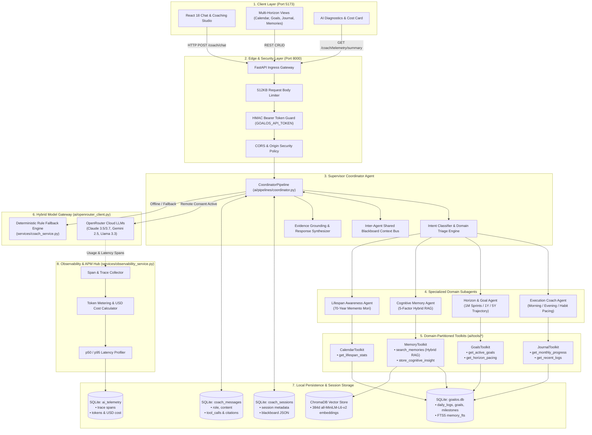
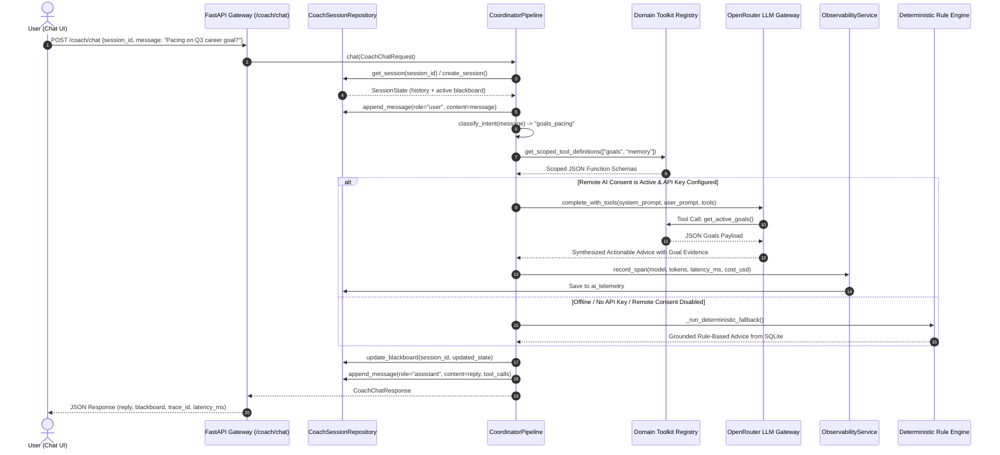

# 🏛️ Production Agentic System Design & Architecture Mapping

---

## 📋 Document Control & Metadata

| Attribute | Specification |
| :--- | :--- |
| **System Name** | GoalOS Executive AI Platform |
| **Architecture Pattern** | Supervisor-Coordinator Multi-Agent Pattern with Domain Toolkits & Blackboard State |
| **Reference Architecture** | Enterprise Banking Agentic AI Design (Zero-Trust, Observability, Session Store, MCP Toolkits) |
| **Implementation Classification** | Local-First, Sovereign, Deterministic Fallback-Enabled |
| **Repository Root** | `C:\Users\jegad\projects\GoalOS` |
| **Document Status** | Approved & Implemented in Production (v2.6.0) |

---

## 1. 🌟 Executive Summary & Architectural Evolution

This document specifies the exact mapping between enterprise-grade production agent architectures (such as banking conversational AI systems) and the **GoalOS Local-First Multi-Agent Architecture**.

GoalOS extracts the core production patterns:
1. **Supervisor Coordinator Agent** for unified intent triage and multi-agent dispatching.
2. **Domain-Partitioned Toolkits** (MCP-ready interface) to eliminate prompt bloat and prevent tool hallucinations.
3. **Persistent Session Store & Blackboard State** for multi-turn conversational history and inter-agent context sharing.
4. **Real-Time Observability & AI Cost Tracker** for trace span profiling, token metering, and live USD spend calculations.
5. **Deterministic Fallback Engine** ensuring 100% operational availability without remote cloud LLM dependencies.

---

## 2. 🗺️ High-Level System Architecture Diagram

---

## 3. 🔄 Multi-Agent Coordination Sequence & Data Flow

---

## 4. 📊 Layer-by-Layer Architectural Mapping Table

| Reference Banking Component | GoalOS Production Component | Implementation Location | Production Responsibility |
| :--- | :--- | :--- | :--- |
| **User Interface (chat)** | Chat Studio & Multi-Horizon Views | `frontend/src/` | Interactive multi-turn coaching, week calendar, daily journal. |
| **Edge Layer (WAF, Rate Limit, API GW)** | FastAPI Security Middleware | `api/main.py` | 512KB payload ceiling, HMAC constant-time auth token guard, CORS validation. |
| **Authentication / IdP** | HMAC Bearer Token Validator | `api/main.py::require_api_token` | Validates API tokens in constant time (`hmac.compare_digest`). |
| **PII & Data Guard** | Local-First Sovereign Persistence | `database/migrations.py` | Zero telemetry or personal data leaves the machine unless explicitly consented. |
| **Coordinator Agent** | Supervisor Coordinator Pipeline | `ai/pipelines/coordinator.py` | Intent classification, domain delegation, response synthesis, and fallback routing. |
| **Accounts / Tx / Service Subagents** | Domain Coach Subagents | `ai/pipelines/*` | `ExecutionCoach`, `GoalAlignmentCoach`, `ProgressCoach`, `FutureSelfCoach`. |
| **Modular MCP Tool Servers** | Domain-Partitioned Toolkits | `ai/tools/*` | `MemoryToolkit`, `GoalsToolkit`, `JournalToolkit`, `CalendarToolkit`. |
| **Session Store & Inter-Agent State** | SQLite Sessions & Blackboard | `database/repositories/coach_session_repository.py` | `coach_sessions` and `coach_messages` with structured JSON blackboard. |
| **LLM Gateway (Hybrid)** | OpenRouter Client + Rule Engine | `ai/openrouter_client.py`, `services/coach_service.py` | Leaky-bucket rate limited cloud models + instant deterministic fallback. |
| **Observability Hub & Cost Tracker** | Telemetry & APM Service | `services/observability_service.py`, `database/repositories/telemetry_repository.py` | Live token tracking, latency percentiles (p50/p95), and USD model spend estimation. |
| **Agent Evaluation Suite** | 6 Vision Metrics Evaluator | `ai/eval/` (`evaluator.py`, `metrics.py`) | JSON integrity, Grounding, Actionability, Horizon Alignment, Tool Precision, Efficiency. |

---

## 5. 🛡️ Architectural Invariants & Guarantees

1. **Context Manager SQLite Transactions:** All persistence MUST use `with get_db() as conn:`.
2. **Deterministic Fallback Invariant:** If remote AI fails or is disabled, the system MUST return high-utility deterministic rules with `source = 'deterministic_rules'`.
3. **Domain Tool Scoping:** Subagents MUST only receive the tool definitions relevant to their domain to conserve prompt tokens and prevent tool hallucinations.
4. **Telemetry Non-Interference:** Telemetry and cost tracking operations MUST be non-blocking and never interrupt core user execution.
